# What I Have Learned

## 1 Quality Code

### Informal

#### Client
##### External Quality

<figure>
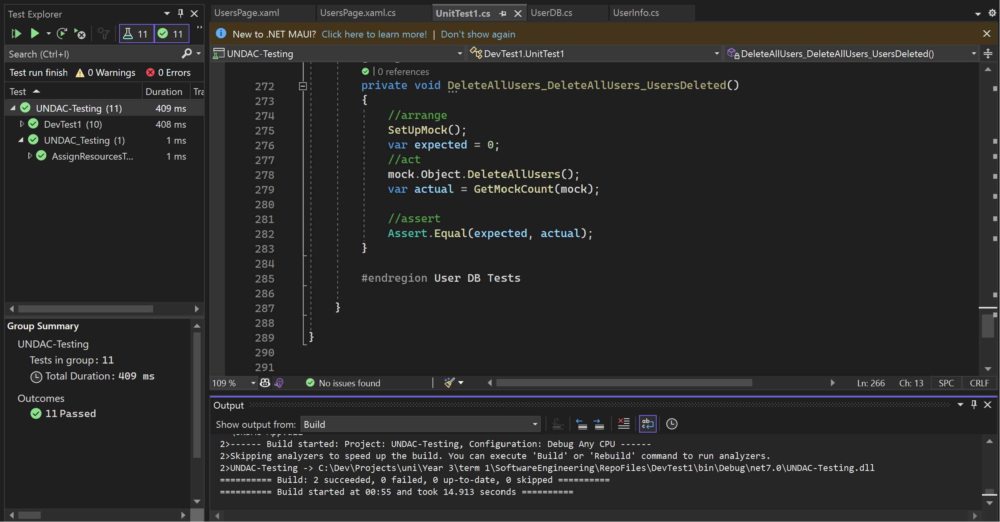
<figcaption align = "center"><b>Fig.1 - Testing</b></figcaption></figure>
  

<figure>
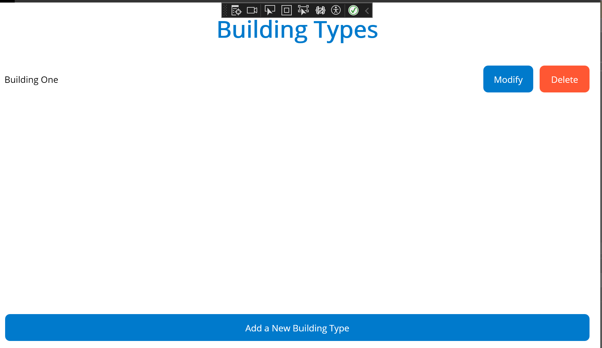
<figcaption align = "center"><b>Fig.2 - Colleagues theme</b></figcaption></figure>
  

<figure>
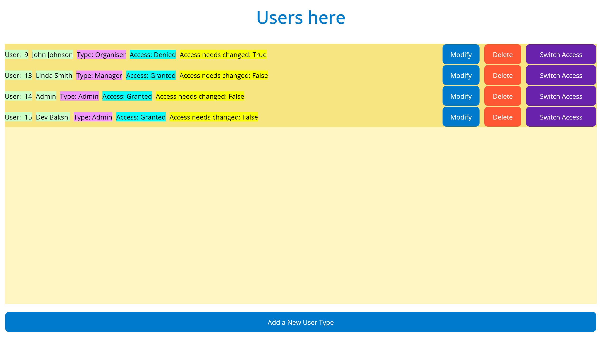
<figcaption align = "center"><b>Fig.3 Matching Theme </b></figcaption></figure>

By ensuring:
 * Code is well tested the product will be easily maintained and more robust (fig.1)

* meeting the needs of the client specification and with a user friendly UI that follows a consistent theme, users can enjoy a smooth experience with a predictable system that is easy to navigate to perform required tasks.

Secure well tested and robust systems created with good software quality are easier to maintain and update resulting in higher efficiency and lower costs.

#### Internal Quality
  <figure>
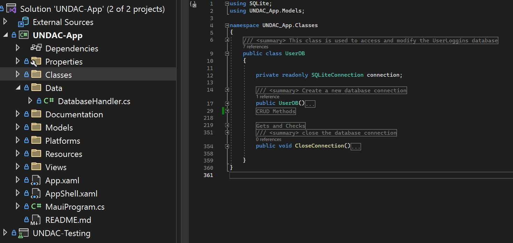
<figcaption align = "center"><b>Fig.4 Organisation</b></figcaption></figure>

Important aspects of Internal quality are :

 * Naming Conventions,
 * Self descriptive code 
 * Summary/Documentation comments 
 * Exception Handling
 * structure and indentation 
 * functons
    * Have names that are verbs
    * Be short
    * Have a small number of parameters
    * Do one thing
* Software engineering principles.
* being aware of code smells

* Time management
 * clean code
   * Discuss Code Principles,
     * yagni
     * Dry 
     * Kiss 
   * smells from intuition suit seniors doing reviews.
     * many parameters
     * large functions/classes
     * mysterious Names
 * Technical debt 

  <figure>
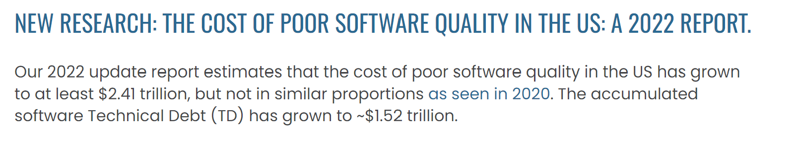
<figcaption align = "center"><b>Fig.4 tech debt </b></figcaption></figure>
 https://www.it-cisq.org/the-cost-of-poor-quality-software-in-the-us-a-2022-report/

## formal

## Code quality examples

  <figure>
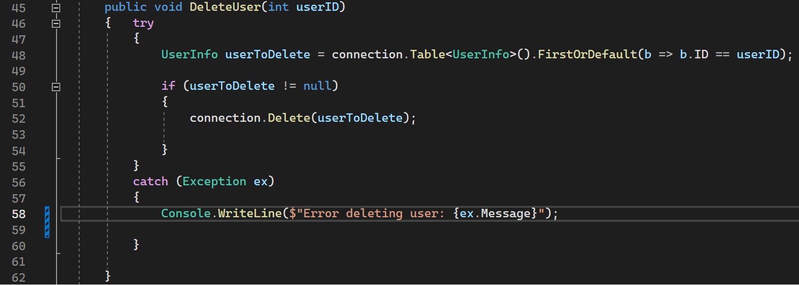
<figcaption align = "center"><b>Fig.5 Clean Code </b></figcaption></figure>

* Clear method name with verb.
* Single responsibilty. (removes user from table)
* low parameter count.
* exception handling/logging for maintainability.
* Indented properly
* Self Describing and readible no need for comments.
* No mystery naming.
* Follows Kiss and YAGNI

  <figure>
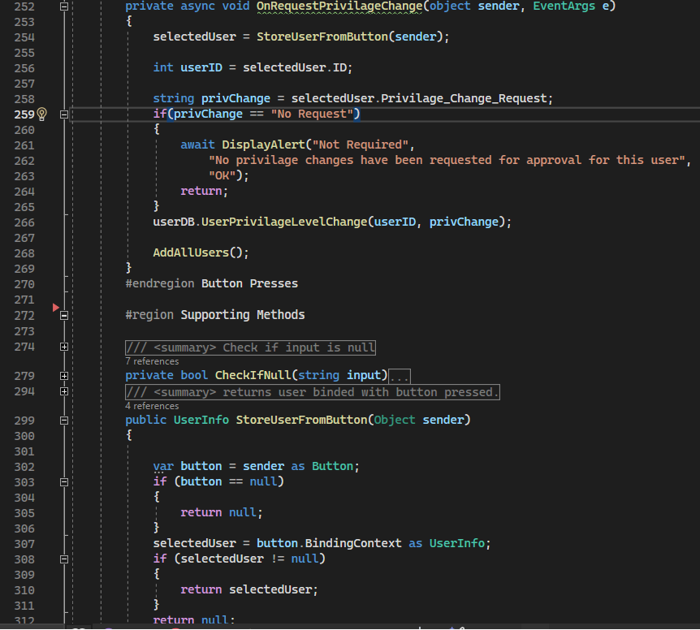
<figcaption align = "center"><b>Fig.6 DRY </b></figcaption></figure>

 * Use of supporting method to eliminate repeate code
 * Use of Regions to organise code 

## 2. How I apply my practice of quality

### My quality routine
To ensure the quality of my code I Strive to write with the core principles Yagni, Kiss, SRP and DRY in mind as these ensure maintenance and refractoring are easier After writing my code I then do a self review whilst investigating better code logic for more efficient and reliable alternatives.

### Quality boosting elements of team workflow 
Version Control, Testing and Code reviews are ideal elements of workflows that allow team members to keep an eye on changes and conflicts, revert to previous versions if necessary, and maintain a consistent codebase. Regular testing throughout the development  helps find and resolve bugs earlier, preventing them from building up and code reviews also help individules recieve direct feedback and advice and are a direct way for members to see and understand each others strenghts and limitations

### IDE features that help quality
* Refactoring tools: automate renaming
* Syntax Highlighting and Code Completion: readibility and reduces typos
* Static Code Analysis: Identifies issues without running code.
Debugging: allows examining variable values steb by step to find error sources.
  <figure>
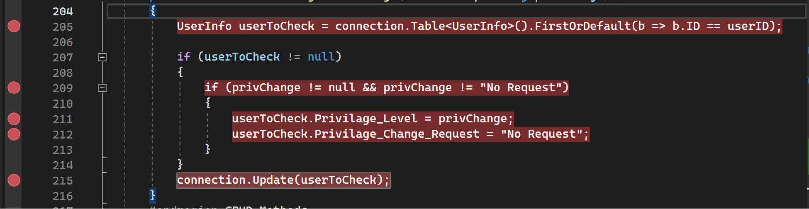
<figcaption align = "center"><b>Fig.7 Debugging Tool </b></figcaption></figure>

* Version controle: track changes and revert efficiently.

* Extensions that can check code coverage (Testing) 

### What I improved the most

I improved the most on writing quality methods in regards to :
* DRY and SRP

### Attempt to maximise quality
For me to maximise quality I began to write Unit tests with Xunit framework to provide an efficient automated way for finding issues when making changes to the system overall improving the systems maintainability.

  <figure>
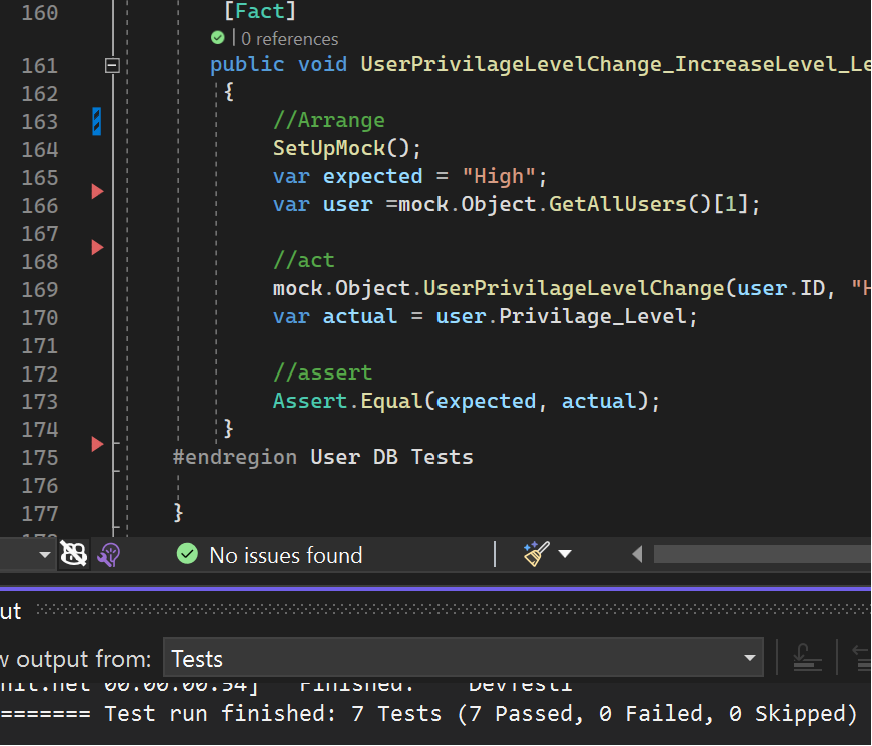
<figcaption align = "center"><b>Fig.8 week 11 Tests </b></figcaption></figure>

## 3. Evaluate software quality

qualitive
subjective evaluations
Readability:
* How easy is the code to read and understand?
* is it consistent
* variable and function names descriptive and meaningful
* Documentation: Is the code adequately documented?

Maintainability: 
* easy to modify and extend?
* clear separation of concerns?
* how much technical technical debt

<figure>
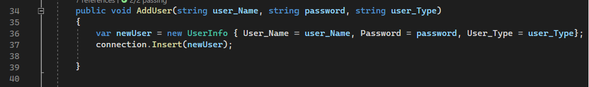
<figcaption align = "center"><b>Fig.9 - Cyclomatic complexity : 1</b></figcaption></figure>
  

quantative
quantifiable evalutation.
* Lines of code (LOC)
* Number of functions (NOF)
* depth of inheritence
* Cyclomatic complexity
* Code coverage

## 4. Critique software development processes
The part that worked best I found was code Reviews as it is more a collective ownership when we are looking at each others code and I noticed people improved on their code positivley when given feedback when reviewing their code again.
<figure>
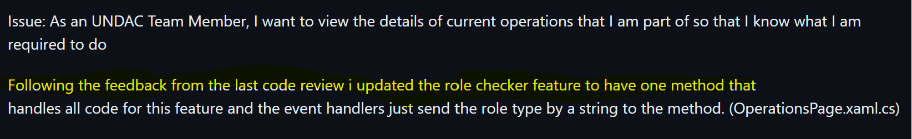
<figcaption align = "center"><b>Fig.10 - positive change</b></figcaption></figure>
  

I think my biggest improvement was Code reviews as it is not something I have done before when using Github.

I think the most important thing in teamwork is collaboration and communication, since we are working from the self organisation aspect of scrum i believe These aspects help ensure that although members are managing themselfs when communicating and collaborating our contributions are consistent with each other for the projects outcome.

I think the downsides of self organising is that the working environment can drift apart and become increasingly difficult to merge together when there is lack of clear direction, theme and this can be a direct result of limited communication and planing.

This is why I think regular reviews, design structure and clear goals and objectives are the most essential  parts of software development processes.

<figure>
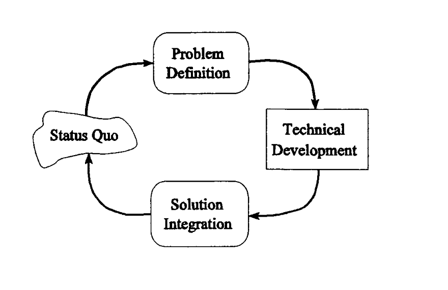
<figcaption align = "center"><b>Fig.7 - Chaos Model</b></figcaption></figure>
  

<figure>

<figcaption align = "center"><b>Fig.7 - Chaos Model</b></figcaption></figure>
  

Chaos model by L.B.S racoon
https://dl.acm.org/doi/pdf/10.1145/225907.225914

### usefull screenshots
#### version controle
<figure>
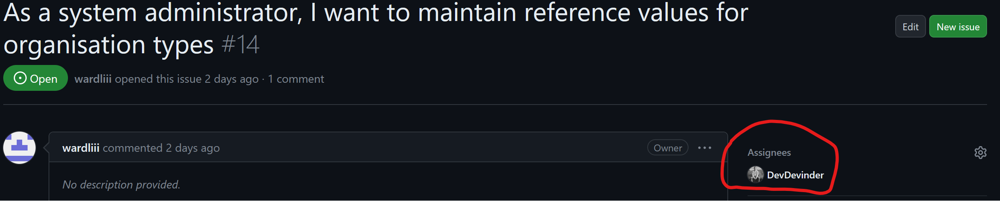
<figcaption align = "center"><b>Fig.1 - Self Assigned to issue</b></figcaption></figure>
  

<figure>

<figcaption align = "center"><b>Fig.2 - Project board</b></figcaption></figure>
  

  
<figure>
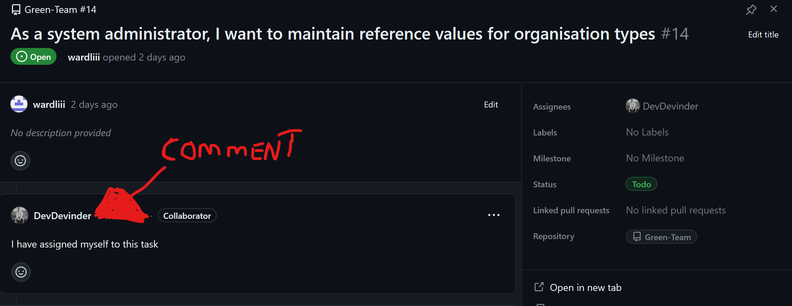
<figcaption align = "center"><b>Fig.3 - Project board task comment</b></figcaption></figure>
  

  
<figure>

<figcaption align = "center"><b>Fig.4 - personal branch made from main (template) </b></figcaption></figure>
  

#### Code review

 #### Refer to week 8 Code review to show steps to improve myself.

<figcaption align = "center"><b>Fig.11 Overall Feedback</b></figcaption></figure>
  <figure>
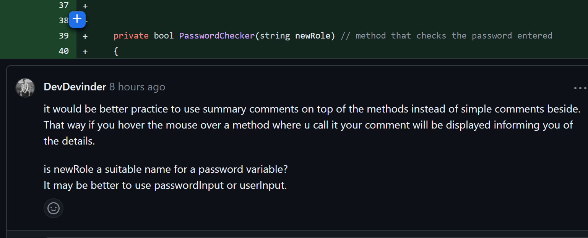
<figcaption align = "center"><b>Fig.12 Comment recomendation</b></figcaption></figure>
  <figure>
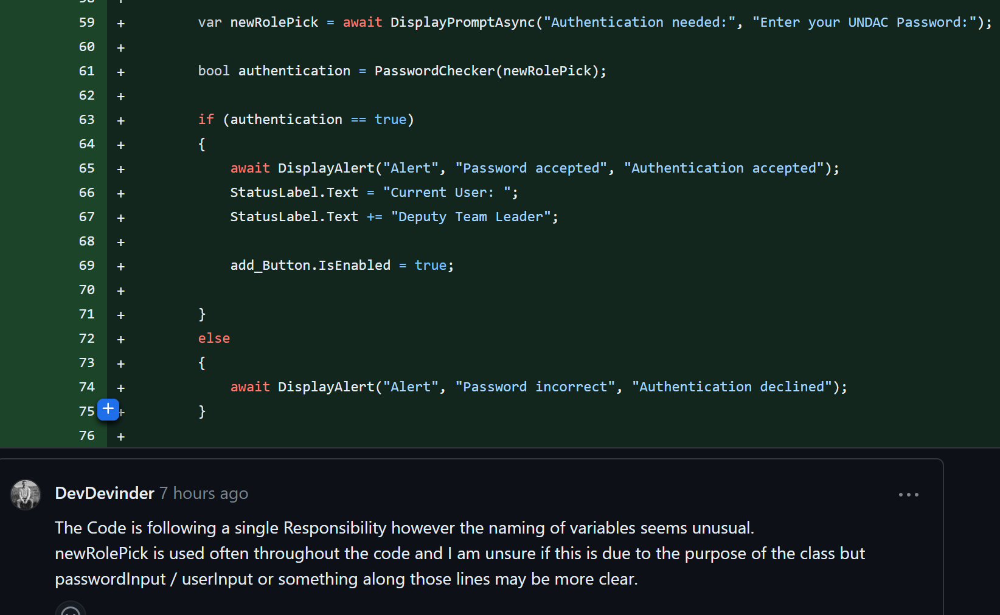
<figcaption align = "center"><b>Fig.13 Variable namings</b></figcaption></figure>
  <figure>

 * smells like : mysterious  naming

<figcaption align = "center"><b>Fig.14 Code Repeats</b></figcaption></figure>
  <figure>

<figcaption align = "center"><b>Fig.15 Redundant comment</b></figcaption></figure>
  <figure>

  <figure>
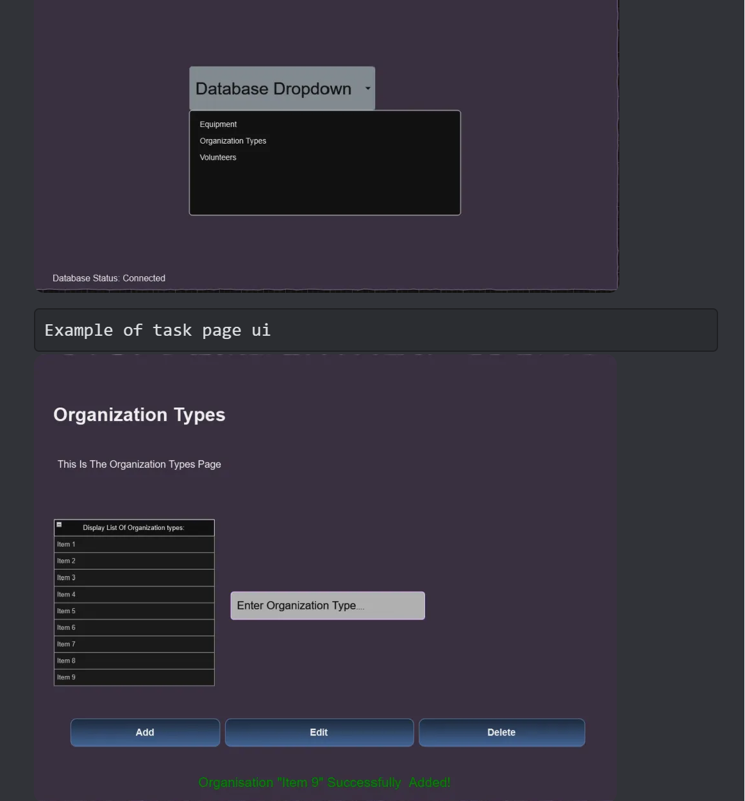
<figcaption align = "center"><b>Fig.15 wireframes</b></figcaption></figure>
  <figure>

