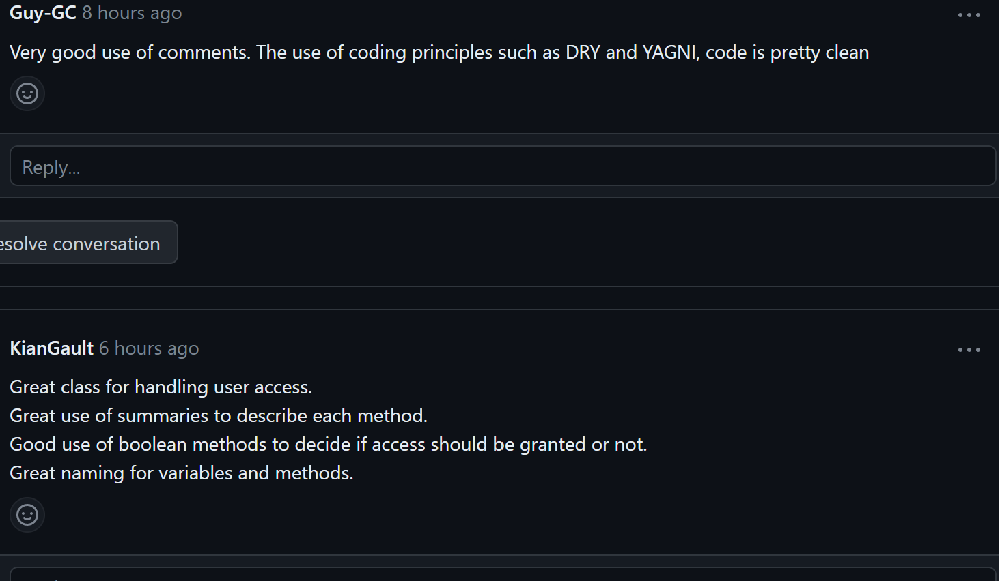
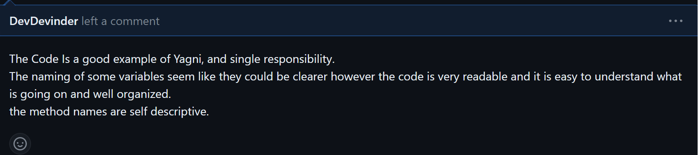
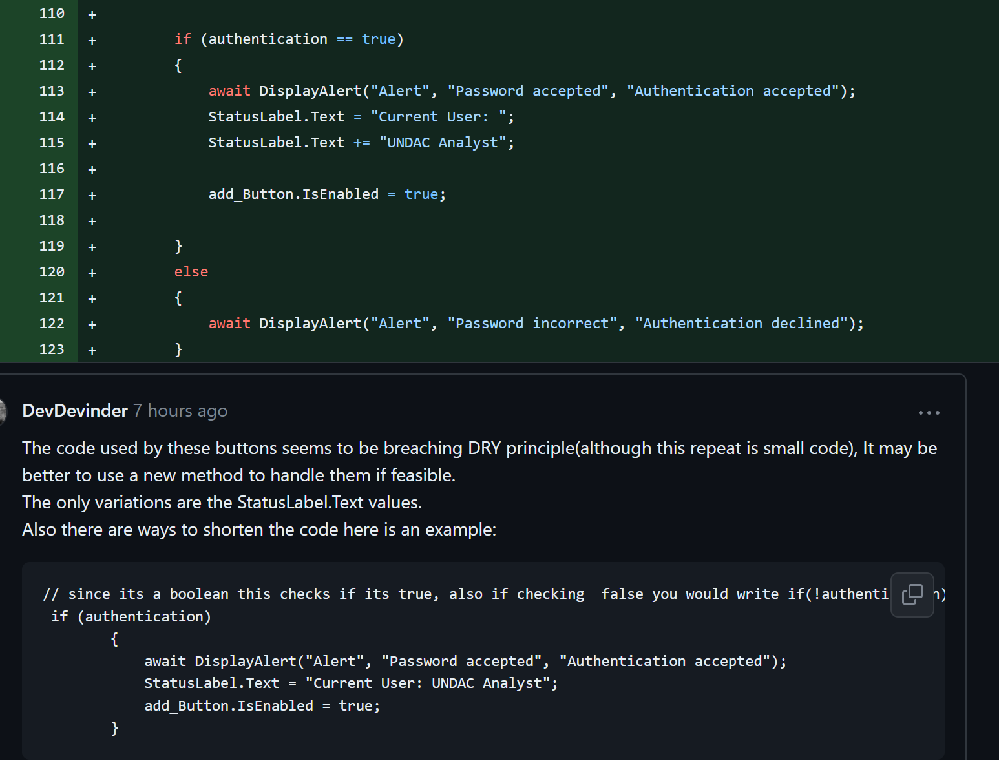
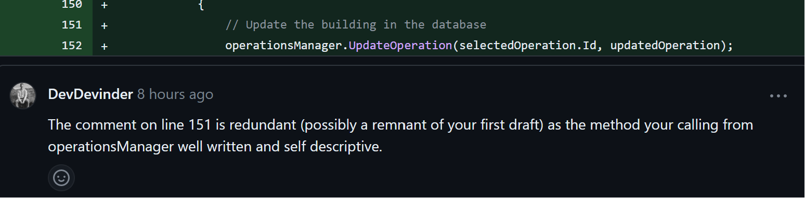

# Project work 3 - week 10

## Brief
The Task for this weeks entry is to do a continuation of the project from week 10 and to demonstrate how my software engineering practice is improving.

For this portfolio entry I will summarise my use of good software principles with some screenshots capturing these principles being implemented. This will result in less classes being talked about in terms of Software Principles as I will avoid discussing the same principle multiple times through code snippets and instead continue to focus more on reflection of my progress as a software engineer.


I will also include an appendix of my code this week at the end of this entry.


## Issue Task
For this week I have Completed a new task Issue:
 ***As a system administrator, I want to reinstate access for users who return to the team so that they have access to the information they need***


And made changes to my work done on the previous task issue:

 ***As an UNDAC Team Support and Logistics Manager, I want to request the removal of access for users when they leave so that effective security is maintained***


 To Achieve the administration system I created new classes that allow an admin to manage The users.

 Below is a screenshot of the user interface that the admin can use to reinstate users.

<figure>

<figcaption align = "center"><b>Fig.1 Add User page </b></figcaption></figure>


This part of the system also allows the manager to update user information, change users access levels, and add/remove users.

I have also improved on the task so that the admin can switch user Access to be granted or denied aswell as adding, Modifying and removing users from the database. 

Now that their is a suitable system for managing and adding users I removed those features from the UserAccess page so now the UserAccess page only allows a Manager and admin to view and request access changes for each user.
Below is a look at the User Access page:

<figure>

<figcaption align = "center"><b>Fig.2 User Access page </b></figcaption></figure>


## Software principles used

### UserInfo class
    This class has replaced the UserAccess.cs As UserAccess.cs has become redundant now due to the code changes this week.

 <figure>

<figcaption align = "center"><b>Fig.3 UserInfo class </b></figcaption></figure>

#### Purpose of class:
  

The UserInfo class is held in the Models folder. 

This class is a model for a database table that stores user information. The table has six columns:


  * ID: A unique identifier for the user login.
  * User_Type: The type of user (e.g. admin, user).
  * User_Name: The user's name.
  * Password: The user's password.
  * User_Access: The user's access level (e.g. granted, denied).
  * accessRequest: A boolean value to indicate whether the manager has requested access level changes on the user.

The class also contains a constructor that initializes the User_Type, User_Name, Password, and User_Access fields With default properties of an admin.
 
 #### Principles used:

Principles used  in the *UserInfo* class here are:

* **YAGNI:**

Everything in this class is used and currently serves a purpose.

* **Encapsulation:**

User information and properties are encapsulated by this class which provides data protection. access to the class and date is through defined methods

* **Data Abstraction:**

The class provides a consistent way to access and manage user information without worrying about specific database technologies being used. 

* **Single Responsibility:**

The class focus is to only handle managing user information. 

* **Seperation of concerns**

Seperated from other classes.

* **Open/Closed principle:**

Is open to extension as new features can be added without the need of changing the existing code.

* **Intention Revealing::**

The naming of variables is self descriptive.

* **KISS**: The code is simple and straight forward without unnecessary complexity.

These principles have allowed this class to be easily maintainable by myself and by others who havent been informed of it and should remain so even when coming back to it after a long break.


### UsersPage class
The UsersPage class is held in the Views folder.
 <figure>

<figcaption align = "center"><b>Fig.4 UserPage- Adding user</b></figcaption></figure>

#### Purpose of class:
  
This class is for admins to manage user information through an interface. It uses the "UserDB" class to perform CRUD operations and displays a list of users for the admin to see.

Methods:

    OnAppearing(): Pop up screen that displays when the page loads. Prompts login to verify themselves before showing the page.

    OnUserAdd(): Adds a new user to the database.

    OnUserDelete(): Deletes selected user.

    OnUserTapped(): Handles user selection and calls OnUserUpdate method.

    OnUserUpdate(): Updates the selected user's information based on the selected option from an action sheet.

    OnUserAccessChange(): Switches the selected user's access level.

    CheckIfNull(): Checks if input is null or empty.

    AddAllUsers: Clears the user list then adds all users from the database to the list.

    IsUserInDatabase: Checks if user is in database to.
 
 #### Principle used:

* **Separation of concerns:**
   The class handles the UI elements and user input but relies on the UserDB class to interact with the database.

* **KISS:**
   Avoids uneccessary complexity, the code is Straight to the point, clear and readible.


### Testing
This Week I seeked assistance from a classmate of another team to set up the testing environment(main issue was file structures and file references), once set up I informed my team and requested to merge my testing environment so that others can begin testing on a functioning environment.

The testing framework we are using is Xunit.

 <figure>

<figcaption align = "center"><b>Fig.5 XUnit Tests</b></figcaption></figure>

Fig.5 above shows two testing methods on the right and the pass states on the left with the matching names.

The two testing methods are:

* *OnUserAdd_InsertUser_UserNameInDB*
 
 Which is testing if a user is successfully added to the database.

* *CheckUser_FalseUserName_NameNotInDB*
 
 Which is testing if a user is not in a database.

These tests are not using any Mock Objects at this stage as the data is stored locally.

The test codes written here are self explanetory, following the naming convention for c# test methods which makes it easier to understand and identify in the test explorer.

I have yet to attempt a test driven development out of interest, where tests are written before methods, however our workflow isnt following this approach and instead we have opted to write tests post method creation.

I still need more time to write more tests on the rest of the functions moving forward.
### Code Review

#### Review of My Code:

  <figure>

<figcaption align = "center"><b>Fig.6 Review UserAccessPage.xaml</b></figcaption></figure>
  <figure>

<figcaption align = "center"><b>Fig.7 UserDB feedback</b></figcaption></figure>
  <figure>

<figcaption align = "center"><b>Fig.8 Unit Test feedback </b></figcaption></figure>

  <figure>

<figcaption align = "center"><b>Fig.9 UserAccessDB feedback</b></figcaption></figure>

  <figure>

<figcaption align = "center"><b>Fig.10 Room For improvment</b></figcaption></figure>

The code review I recieved Was entirely possitive again.
Had one code recomendation for improvement (shown in Fig.10) which has helped me to rethink my Code structure habbits when doing If-else condintions.
I will improve the if-else sections during the next practical session.

Seing classmates Reviewing my Code and stating the practices I am using such as DRY and YAGNI is helping me to feel confident I am on the right track now writing clear concise code.


#### Review of Team member:

<figcaption align = "center"><b>Fig.11 Overall Feedback</b></figcaption></figure>
  <figure>

<figcaption align = "center"><b>Fig.12 Comment recomendation</b></figcaption></figure>
  <figure>

<figcaption align = "center"><b>Fig.13 Variable namings</b></figcaption></figure>
  <figure>

<figcaption align = "center"><b>Fig.14 Code Repeats</b></figcaption></figure>
  <figure>

<figcaption align = "center"><b>Fig.15 Redundant comment</b></figcaption></figure>
  <figure>


Overall the code I reviewed looked good, was readible and well written. The only issues worth mentioning that I noticed were namings of variables seemed unusual for their purpose that appear in many places which seem to be a case of the *code smell* Duplicate Code.

I offered advice on naming variables as shown in Fig.14 with tips on shortening code.

I also gave some advice regading writing comments as shown in Fig.12
as the comment was a standard comment with limited information where the benifits of using summary comments allow the comments to be revealed when hovering over methods where they are called which is a usefull feature of Visual studio and c#.


## Reflection

### Code Reviews

Since doing the reviews I have been trying to write self descriptive code that my team members can easily understand, due to this I have noticed that my naming conventions have become a lot clearer than before taking the course as prior to this I had sometimes relied on comments to do the talking rather than code. 

I find it interesting still to see similarities between team members code habbits and my own aswell as the differences.
Even though we worked on our own tasks I noticed that one team member had tried to do a log in system, which although was utilised slightly differently it was interesting to see we both had a similar thought process for our tasks functional design.

I feel the biggest differences with code writing from the team  members work I have seen compared to mine is that I avoid breaching DRY a bit more and I tend to have slightly more advanced ways of handling classes. This is to be expected  due to the various skillsets and experiences with C# in the team.

### Final Thoughts on week 10

I still need to improve on my knowledge base of the frameworks however I do feel much more confident with them now, to write readible and maintainable code that others can understand. 

I noticed I have fallen behind on using Try/catches and exception handling this week which I will reintroduce moving forward next time include moving forward so that code is running more securely. I think focusing on speed and functionality is the cause in this lack of robustness.

Im still lacking with UI design on the .xaml files and find my knowkedge limited here. If I had more knowledge of the xaml files I may have been able to write superior code functions but for the purposes of our tasks the xaml code is very straight forward enough to do a basic UI. 

Overall to conclude I feel even more confident about the workflow, using version controles with Visual studio and writing unit tests, noticed I can work faster now(which is to be expected when working on a project for some time). In terms of improving with regards to Principles I feel I have more refined my style of following the principles discussed in the "principles used" and being more mindfull of them when writing code.

I feel the team are much more likely to respond in our communication channel Discord these days however I feel we could have done better as a team to resolve testing earlier.
Part of the difficulties with communication and resolving issues in a team seems to fall under remote working as team members are more communicative during the practicals.

I'm much less worried now about merges to the main affecting the project for others, as I was in the begining.

I have reached a point with the tasks that I was hoping for as in the begining the *UserAccesspage* was handling things it shouldnt really such as adding and removing users but I have now put those functions into the *UsersPage* page so the the former is now focusing entirlely on allowing managers to request access changes.


### APPENDIX

#### UserInfo
```c#
using SQLite;
namespace UNDAC_App.Models
{
    /// <summary>
    ///  this class is used to create a userInfo table
    /// </summary>
    public class UserInfo
    {
       
        [PrimaryKey, AutoIncrement]
        public int ID { get; set; }
        public string User_Type { get; set; }
        public string User_Name { get; set; }
        public string Password { get; set; }

        public string User_Access { get; set; }
        public bool accessRequest { get; set; }
        
        /// <summary>
        /// Default constructor
        /// </summary>
        public UserInfo()
        {
            User_Type = "Admin";
            User_Name = "Admin";
            Password = "Admin";
            User_Access = "Granted";
        }     
    }
}
```

#### UserDB
```c#
using SQLite;
using UNDAC_App.Models;

namespace UNDAC_App.Classes
{ 
    /// <summary>
    /// This class is used to access and modify the UserLoggins database
    /// </summary>
    public class UserDB
    {

        private readonly SQLiteConnection connection;
       
        /// <summary>
        /// Create a new database connection
        /// </summary>
        public UserDB()
        {
            this.connection = DatabaseManager.DBconn();
            connection.CreateTable<UserInfo>();

            // add a default user if table is empty or there is no admin type user (Ensures page is always accessible by atleast one admin.
             if(connection.Table<UserInfo>().Count() == 0 || connection.Table<UserInfo>().FirstOrDefault(b => b.User_Type == "Admin") == null)
            {
                connection.Insert(new UserInfo());
            }

        }

        /// <summary>
        /// Checks if a user with the name has this password in the userLoggins table in database
        /// </summary>
        /// <param name="user_Name"></param>
        /// <param name="password"></param>
        /// <returns>True if matches False if not</returns>
        public bool CheckPassword(string user_Name, string password)
        {
            UserInfo userToCheck = connection.Table<UserInfo>().FirstOrDefault(b => b.User_Name == user_Name);
            if (userToCheck != null)
            {
                if (userToCheck.Password == password)
                {
                    return true;
                }
                else
                {
                    return false;
                }
            }
            else
            {
                return false;

            }
        }

        /// <summary>
        /// Gets the user ID from the userLoggins table in database 
        /// if the user name and password match
        /// </summary>
        /// <param name="user_Name"></param>
        /// <param name="password"></param>
        /// <returns>ID number if found otherwise zero</returns>
        public int GetUserID(string user_Name, string password)
        {
            UserInfo userToCheck = connection.Table<UserInfo>().FirstOrDefault(b => b.User_Name == user_Name);
            if (userToCheck != null)
            {
                if (CheckPassword(user_Name, password))
                {
                    return userToCheck.ID;

                }
                else
                {
                    return 0;
                }
            }
            else
            {
                return 0;

            }      
        }

        /// <summary>
        /// add a user to the user login table in database
        /// </summary>
        public void AddUser(string user_Name, string password, string user_Type)
        {
            var newUser = new UserInfo { User_Name = user_Name, Password = password, User_Type = user_Type};
            connection.Insert(newUser);
        }

        /// <summary>
        /// update a user in the userLoggins table in database
        /// </summary>   
        public void UpdateUser(int userID, string new_user_Name, string password, string new_user_Type)
        {
            UserInfo userToUpdate = connection.Table<UserInfo>().FirstOrDefault(b => b.ID == userID);
            if (userToUpdate != null)
            {
                userToUpdate.User_Name = new_user_Name;
                userToUpdate.Password = password;
                userToUpdate.User_Type = new_user_Type;
                connection.Update(userToUpdate);
            }
        }

        /// <summary>
        /// Delete a user from the userLoggins Table in database
        /// </summary>  
        public void DeleteUser(int userID)
        {
            UserInfo userToDelete = connection.Table<UserInfo>().FirstOrDefault(b => b.ID == userID);
            if (userToDelete != null)
            {
                connection.Delete(userToDelete);
            }
        }

        ///<summary>
        ///Change user access in userloggin table in database based on access level.
        ///Ensures that admin user access cannot be changed
        /// </summary>
        public void UpdateUserAccess(int userID, bool access)
        {
            UserInfo userToUpdate = connection.Table<UserInfo>().FirstOrDefault(b => b.ID== userID);
            
            if (userToUpdate != null)
            {
            
                if (userToUpdate.User_Access == "Granted" && userToUpdate.User_Name != "Admin")
                {
                    userToUpdate.User_Access = "Denied";
                }
                else
                {
                    userToUpdate.User_Access = "Granted";
                }
                userToUpdate.accessRequest = false;
                connection.Update(userToUpdate);
                
            }
        }


       /// <summary>
       /// list all users in the database
       /// </summary>
        public List<UserInfo> GetAllUsers()
        {
            return connection.Table<UserInfo>().ToList();
        }

        /// <summary>
        /// check if user is in the database
        /// returns true if found false if not.
        /// </summary>
        public  bool CheckUser(string user_Name)
        {
            UserInfo userToCheck = connection.Table<UserInfo>().FirstOrDefault(b => b.User_Name == user_Name);
            if (userToCheck != null)
            {
                return true;
            }
            else
            {
                return false;
            }
        }


        /// <summary>
        /// checks the users type based on their ID from the userLoggins table in database
        /// </summary>
        /// <param name="userID"></param>
        /// <returns> users type if found otherwise infroms if not found</returns>
        public string CheckUserType(int userID)
        {
            UserInfo userToCheck = connection.Table<UserInfo>().FirstOrDefault(b => b.ID == userID);
            if (userToCheck != null)
            {
                return userToCheck.User_Type;
            }
            else
            {
                return "User not found";
            }
        }

        /// <summary>
        /// checks user access level from userloggin table in database
        /// </summary>
        /// <param name="userID"></param>
        /// <returns> true if access level is granted, false if anything else </returns>
        public bool CheckUserAccess(int userID)
        {
            UserInfo userToCheck = connection.Table<UserInfo>().FirstOrDefault(b => b.ID == userID);
            if (userToCheck != null)
            {
                if (userToCheck.User_Access == "Granted")
                {
                    return true;
                }
                else
                {
                    return false;
                }
            }
            else
            {
                return false;

            }  
        }

        /// <summary>
        /// close the database connection
        /// </summary>
        public void CloseConnection()
        {
            connection.Close();
        }
    }
}
```
#### UsersPage.xaml.cs
```c#
using UNDAC_App.Data;
using UNDAC_App.Models;
using UNDAC_App.Classes;
using System.Collections.ObjectModel;

namespace UNDAC_App
{

    /// <summary>
    /// this class is used by the admin to add users to the database and modify them
    /// This class deals with UserLoggins.cs (database class and UserDB.cs ) (database modification class)
    /// </summary>
    public partial class UsersPage   : ContentPage
    {
        
        private ObservableCollection<UserInfo> userLoggins;// ObservableCollection used to display the list of users
        private UserDB userDB; // database connection class
        private UserInfo selectedUser; // selected user from the user logins database

       /// <summary>
       ///  Initializes the page and create a new database connection 
       /// </summary>
        public UsersPage()
        {
            InitializeComponent();
            userDB = new UserDB();
            userLoggins = new ObservableCollection<UserInfo>(userDB.GetAllUsers());
            UserListView.ItemsSource = userLoggins;
        }

        #region Login Popup Window

        /// <summary>
        /// Pop up: when page loads for user log in to display page if user has access
        /// Access is granted if user is an admin or manager and the user has access privalages
        /// </summary>
        protected override async void OnAppearing()
        {
            base.OnAppearing();

    
            Button button = this.FindByName<Button>("AddUserButton");

            UserListView.IsVisible = false;
            button.IsVisible = false;

            var userPrompt = await DisplayAlert("Login", "Please enter your username and password", "OK", "Cancel");
            if (userPrompt == true)
            {
                var userName = await DisplayPromptAsync("Login", "Username");
                var password = await DisplayPromptAsync("Login", "Password");

                if (userDB.CheckUser(userName))
                {
                    if (userDB.CheckPassword(userName, password))
                    {
                        var userID = userDB.GetUserID(userName, password);

                        if (userDB.CheckUserType(userID) == "Admin" && userDB.CheckUserAccess(userID))
                        {
                            await DisplayAlert("Login", "Login Successful", "OK");
                            UserListView.IsVisible = true;
                            button.IsVisible = true;
                        }  
                        else
                        {
                            await DisplayAlert("Login", "You do not have permission here", "OK");
                            await Navigation.PopAsync();
                        }
                    }
                    else
                    {
                        await DisplayAlert("Login", "Incorrect Password", "OK");
                        await Navigation.PopAsync();
                    }
                }
                else
                {
                    await DisplayAlert("Login", "Incorrect Username", "OK");
                    await Navigation.PopAsync();
                }
            }
        }
        #endregion Login Popup Window

        #region Button Presses

        /// <summary>
        /// Button: Add new user to the database
        /// </summary>
        private async void OnUserAdd(object sender, EventArgs e)
        {
            var newUserName = await DisplayPromptAsync("New User",
                               "Enter the name of the new User:");
            if (CheckIfNull(newUserName))
            {
                return;
            }

            var newUserType = await DisplayPromptAsync("New User",
                                              "Enter the type of the new User:");
            if (CheckIfNull(newUserType))
            {
                return;
            }

            var newUserPassword = await DisplayPromptAsync("New User",
                                                             "Enter the password of the new User:");
            if (CheckIfNull(newUserPassword))
            {
                return;
            }

                userDB.AddUser(newUserName, newUserPassword, newUserType);   
                AddAllUsers();
                IsUserInDatabase(newUserName);
           
        }

        /// <summary>
        ///  Button: deletes A user from database
        /// </summary>
        private async void OnUserDelete(object sender, EventArgs e)
        {
            var button = sender as Button;
            if (button != null)
            {
                var selectedUser = button.BindingContext as UserInfo;

                if (selectedUser != null)
                {

                    userDB.DeleteUser(selectedUser.ID);
                    AddAllUsers();

                    await DisplayAlert("User Deleted", "User has been deleted", "OK");

                }
            }
        }

        ///<summary>
        /// when tapping on user in list view:
        /// call the user update method.
        ///</summary>
        private async void OnUserTapped(object sender, ItemTappedEventArgs e)
        {
            
            selectedUser = e.Item as UserInfo;
            if (selectedUser != null)
            {
                OnUserUpdate(sender, e);
            }
                       
        }

        ///<summary>
        ///  Button:
        ///  update user information.
        ///  uses action sheet to let user decide which information to update.
        /// </summary>
        private async void OnUserUpdate(object sender, EventArgs e)
        {
            var button = sender as Button;

            if (button != null)
            {
                var selectedUser = button.BindingContext as UserInfo;

                if (selectedUser != null)
                {
                    int userID = selectedUser.ID;
                    string oldUserName = selectedUser.User_Name;
                    string  oldUserType = selectedUser.User_Type;
                    string oldUserPassword = selectedUser.Password;

                    var action = await DisplayActionSheet("Update User", "Cancel", null, "Change Username", "Change Password", "Change Type");
                    if (action != null)
                    {
                        switch (action)
                        {
                        case "Change Username":
                            var newUserName = await DisplayPromptAsync("Update User",
                                                                       "Enter the new name to update:",
                                                                       placeholder: oldUserName);

                            if (!CheckIfNull(newUserName))
                                {

                                userDB.UpdateUser(userID, newUserName, oldUserPassword, oldUserType);
                                AddAllUsers();     
                                    
                                }

                            break;
                        case "Change Password":
                            var newUserPassword = await DisplayPromptAsync("Update User",
                                                                           "Enter the new password to update:",
                                                                           placeholder: oldUserPassword);

                            if (!CheckIfNull(newUserPassword))
                                {

                                userDB.UpdateUser(userID, oldUserName, newUserPassword, oldUserType);
                                AddAllUsers();
                                
                                }
                            break;
                        case "Change Type":
                            var newUserType = await DisplayPromptAsync("Update User",
                                                                       "Enter the new type to update:", 
                                                                       placeholder: oldUserType);

                            if (!CheckIfNull(newUserType))
                                {
                                userDB.UpdateUser(userID, oldUserName, oldUserPassword, newUserType);
                                AddAllUsers();
                            }
                            break;
                        }   
                    }
                } 

            }      
        }


        /// <summary>
        /// Button: switch access level of user that is selected 
        /// if change has been requested.
        /// </summary>
       
       private async void OnUserAccessChange(object sender, EventArgs e)
        {
            var button = sender as Button;

            if (button != null)
            {
                var selectedUser = button.BindingContext as UserInfo;

                if (selectedUser != null)
                {
                    int userID = selectedUser.ID;
                   
                    bool accessChangeRequested = selectedUser.accessRequest;
                    if (accessChangeRequested == true)
                    {
                        userDB.UpdateUserAccess(userID, accessChangeRequested);
                        AddAllUsers();
                    }
                    else
                    { 
                        await DisplayAlert("Access Change", "no access change requested for this user", "OK");
                    } 
                }
            }
       
        }
        #endregion Button Presses  


        #region Supporting Methods
       
        /// <summary>
        /// Check if input is null
        /// </summary>
        /// <param name="input"></param>
        /// <returns></returns>
        private bool CheckIfNull(string input)
        {
           

            if (string.IsNullOrWhiteSpace(input))
            {
                DisplayAlert("Error", "Please enter a valid input", "OK");
                return true;
            }
            else
            {
                return false;
            }
    
        }

        /// <summary>
        /// clear list then add all users to the list
        /// display the list
        /// </summary>
        private void AddAllUsers()
        {
            userLoggins.Clear();
            foreach (var user in userDB.GetAllUsers())
            {
                userLoggins.Add(user);
            }
            UserListView.ItemsSource = userLoggins;
        }


        ///<summary>
        ///Check if user is in database
        ///</summary>
        private void IsUserInDatabase(string user_Name)
        {
            //tenary operand to display a message to the user depending on if the user is in the database
            DisplayAlert("User Added", userDB.CheckUser(user_Name) ? "User has been added" : "User has not been added", "OK");
        }
#endregion Supporting Methods

    }

}
```

#### UsersPage.xaml
```c#
<?xml version="1.0" encoding="utf-8" ?>
<ContentPage
    x:Class="UNDAC_App.UsersPage"
    xmlns="http://schemas.microsoft.com/dotnet/2021/maui"
    xmlns:x="http://schemas.microsoft.com/winfx/2009/xaml"
    Title="AddUsersPage"
    BackgroundColor="White">
    <StackLayout Padding="16" HorizontalOptions="CenterAndExpand">

        <!--  Title  -->
        <Label
            Margin="0,0,0,32"
            FontAttributes="Bold"
            FontSize="36"
            HorizontalOptions="Center"
            Text="Users here"
            TextColor="#007ACC" />

        <!--  List of building types  -->
        <ListView
            x:Name="UserListView"
            BackgroundColor="#fff6c4"
            ItemTapped="OnUserTapped">
            <ListView.ItemTemplate>
                <DataTemplate>
                    <ViewCell>
                        <StackLayout
                            BackgroundColor="#f7e581"
                            Orientation="Horizontal"
                            Spacing="8">
                            <Label
                                BackgroundColor="#cbffc7"
                                Text="{Binding ID, StringFormat='User:  {0}'}"
                                TextColor="Black"
                                VerticalOptions="CenterAndExpand" />
                            <Label
                                BackgroundColor="#cbffc7"
                                Text="{Binding User_Name}"
                                TextColor="Black"
                                VerticalOptions="CenterAndExpand" />

                            <Label
                                BackgroundColor="#ee96fa"
                                Text="{Binding User_Type, StringFormat='Type: {0}'}"
                                TextColor="Black"
                                VerticalOptions="CenterAndExpand" />
                            <Label
                                BackgroundColor="#03fff7"
                                Text="{Binding User_Access, StringFormat='Access: {0}'}"
                                TextColor="Black"
                                VerticalOptions="CenterAndExpand" />
                            <Label
                                BackgroundColor="#f7ff03"
                                Text="{Binding accessRequest, StringFormat='Access needs changed: {0}'}"
                                TextColor="Black"
                                VerticalOptions="CenterAndExpand" />
                            <Button
                                BackgroundColor="#007ACC"
                                Clicked="OnUserUpdate"
                                CommandParameter="{Binding .}"
                                HeightRequest="40"
                                HorizontalOptions="EndAndExpand"
                                Text="Modify"
                                TextColor="White"
                                WidthRequest="80" />
                            <Button
                                BackgroundColor="#FF5733"
                                Clicked="OnUserDelete"
                                CommandParameter="{Binding .}"
                                HeightRequest="40"
                                HorizontalOptions="End"
                                Text="Delete"
                                TextColor="White"
                                WidthRequest="80" />

                            <Button
                                x:Name="SwitchAccess"
                                BackgroundColor="#6822ab"
                                Clicked="OnUserAccessChange"
                                CommandParameter="{Binding .}"
                                HeightRequest="40"
                                HorizontalOptions="End"
                                Text="Switch Access"
                                TextColor="White"
                                WidthRequest="150" />

                        </StackLayout>
                    </ViewCell>
                </DataTemplate>
            </ListView.ItemTemplate>
        </ListView>

        <!--  Button to add a new organisation type  -->
        <Button
            x:Name="AddUserButton"
            Margin="0,16,0,0"
            BackgroundColor="#007ACC"
            Clicked="OnUserAdd"
            HeightRequest="40"
            Text="Add a New User Type"
            TextColor="White" />
    </StackLayout>
</ContentPage>
```


#### UserAccessDB

```c#
using SQLite;
using UNDAC_App.Models;

/// <summary>
/// This class is used to access the UserAccess database
/// add users, update users, delete users, get all users from the database,
/// check if a user is in the database and to change their access level
/// </summary>
namespace UNDAC_App.Classes
{
    public class UserAccessDB
    {

        private readonly SQLiteConnection connection;
       
        /// <summary>
        /// Create a new database connection
        /// </summary>
        public UserAccessDB()
        {
            this.connection = DatabaseManager.DBconn();
            connection.CreateTable<UserInfo>();
        }

        /// <summary>
        /// Updates access request Info inDatabase by
        /// inverting current access request status
        /// </summary>
        /// <param name="userID"></param>
        /// <param name="accessRequest"></param>
        public void RequestAccess(int userID, bool accessRequest)
        {
            UserInfo userToUpdate = connection.Table<UserInfo>().FirstOrDefault(b => b.ID == userID);
            if (userToUpdate != null)
            {
                userToUpdate.accessRequest = !accessRequest;
                connection.Update(userToUpdate);
            }
        }

       /// <summary>
       /// Gets list of users from userInfo table
       /// </summary>
       /// <returns>List</returns>
        public List<UserInfo> GetAllUsers()
        {
            return connection.Table<UserInfo>().ToList();
        }

        /// <summary>
        /// checks if user is in user Loggins Table
        /// </summary>
        /// <param name="user_Name"></param>
        /// <returns>True if found, False if not</returns>
        public bool CheckUser(string user_Name)
        {
            UserInfo userToCheck = connection.Table<UserInfo>().FirstOrDefault(b => b.User_Name == user_Name);
            if (userToCheck != null)
            {
                return true;
            }
            else
            {
                return false;
            }
        }

        /// <summary>
        /// Gets the user ID from the userInfo table in database 
        /// if the user name and password match
        /// </summary>
        /// <param name="user_Name"></param>
        /// <param name="password"></param>
        /// <returns>ID number if found otherwise zero</returns>
        public int GetUserID(string user_Name, string password)
        {
            UserInfo userToCheck = connection.Table<UserInfo>().FirstOrDefault(b => b.User_Name == user_Name);
            if (userToCheck != null)
            {
                if (CheckPassword(user_Name, password))
                {
                    return userToCheck.ID;

                }
                else
                {
                    return 0;
                }
            }
            else
            {
                return 0;

            }
        }

        /// <summary>
        /// checks user access level from userInfo table in database
        /// </summary>
        /// <param name="userID"></param>
        /// <returns> true if access level is granted, false if anything else </returns>
        public bool CheckPassword(string user_Name, string password)
        {
            UserInfo userToCheck = connection.Table<UserInfo>().FirstOrDefault(b => b.User_Name == user_Name);
            if (userToCheck != null)
            {
                if (userToCheck.Password == password)
                {
                    return true;
                }
                else
                {
                    return false;
                }
            }
            else
            {
                return false;

            }
        }

        /// <summary>
        /// checks the users type based on their ID from the userInfo table in database
        /// </summary>
        /// <param name="userID"></param>
        /// <returns> users type if found otherwise infroms if not found</returns>
        public string CheckUserType(int userID)
        {
            UserInfo userToCheck = connection.Table<UserInfo>().FirstOrDefault(b => b.ID == userID);
            if (userToCheck != null)
            {
                return userToCheck.User_Type;
            }
            else
            {
                return "User not found";
            }
        }

                public bool CheckUserAccess(int userID)
        {
            UserInfo userToCheck = connection.Table<UserInfo>().FirstOrDefault(b => b.ID == userID);
            if (userToCheck != null)
            {
                if (userToCheck.User_Access == "Granted")
                {
                    return true;
                }
                else
                {
                    return false;
                }
            }
            else
            {
                return false;
            }  
        }


        /// <summary>
        /// close the database connection
        /// </summary>
        public void CloseConnection()
        {
            connection.Close();
        }


    }
}

```

#### UserAccessPage.xaml
```c#
<?xml version="1.0" encoding="utf-8" ?>
<ContentPage
    x:Class="UNDAC_App.UserAccessPage"
    xmlns="http://schemas.microsoft.com/dotnet/2021/maui"
    xmlns:x="http://schemas.microsoft.com/winfx/2009/xaml"
    Title="UserAccessPage"
    BackgroundColor="White">

    <StackLayout Padding="16" HorizontalOptions="CenterAndExpand">

        <!--  Title  -->
        <Label
            Margin="0,0,0,32"
            FontAttributes="Bold"
            FontSize="36"
            HorizontalOptions="Center"
            Text="Users here"
            TextColor="#007ACC" />

        <!--  List of building types  -->
        <ListView x:Name="UserListView" BackgroundColor="#fff6c4">
            <ListView.ItemTemplate>
                <DataTemplate>
                    <ViewCell>
                        <StackLayout
                            BackgroundColor="#f7e581"
                            Orientation="Horizontal"
                            Spacing="8">
                            <Label
                                BackgroundColor="#cbffc7"
                                Text="{Binding User_Name, StringFormat='Name:  {0}'}"
                                TextColor="Black"
                                VerticalOptions="CenterAndExpand" />
                            <Label
                                BackgroundColor="#ee96fa"
                                Text="{Binding User_Type, StringFormat='User Type: {0}'}"
                                TextColor="Black"
                                VerticalOptions="CenterAndExpand" />
                            <Label
                                BackgroundColor="#03fff7"
                                Text="{Binding User_Access, StringFormat='User Access: {0}'}"
                                TextColor="Black"
                                VerticalOptions="CenterAndExpand" />
                            <Label
                                BackgroundColor="#f7ff03"
                                Text="{Binding accessRequest, StringFormat='Access change request: {0}'}"
                                TextColor="Black"
                                VerticalOptions="CenterAndExpand" />

                            <Button
                                x:Name="RequestAccessChange"
                                BackgroundColor="#6822ab"
                                Clicked="OnRequestAccessChange"
                                CommandParameter="{Binding .}"
                                HeightRequest="40"
                                HorizontalOptions="EndAndExpand"
                                Text="Request Access Change"
                                TextColor="White"
                                WidthRequest="250" />


                        </StackLayout>
                    </ViewCell>
                </DataTemplate>
            </ListView.ItemTemplate>
        </ListView>

        <!--  Button to add a new organisation type  -->

    </StackLayout>
</ContentPage>
```

#### UserAccessPage.xaml.cs
```c#
using UNDAC_App.Data;
using UNDAC_App.Models;
using UNDAC_App.Classes;
using System.Collections.ObjectModel;

namespace UNDAC_App
{
    /// <summary>
    /// this class is used to display the user access page
    /// This page allows managers to request access changes for users in
    /// UserLoggins database, This class uses the userAccessDB class to access the database
    ///</summary>
    public partial class UserAccessPage : ContentPage
    {

        private ObservableCollection<UserInfo> userLoggins;
        private UserAccessDB userAccessDB;
        private UserInfo selectedUser;

        /// <summary>
        ///  Initializes the page and create a new database connection 
        /// </summary>
        public UserAccessPage()
        {
            InitializeComponent();
            userAccessDB = new UserAccessDB();
            userLoggins = new ObservableCollection<UserInfo>(userAccessDB.GetAllUsers());
            UserListView.ItemsSource = userLoggins;

        }

        #region User Login Popup

        /// <summary>
        /// Pop up for user log in to display page if user has access
        /// Access is granted if user is an admin or manager and the user has access privalages
        /// </summary>
        protected override async void OnAppearing()
        {
            base.OnAppearing();

            UserListView.IsVisible = false;

            var result = await DisplayAlert("Login", "Please enter your username and password", "OK", "Cancel");
            if (result == true)
            {

                var userName = await DisplayPromptAsync("Login", "Username");
                var password = await DisplayPromptAsync("Login", "Password");

                if (userAccessDB.CheckUser(userName))
                {
                    if (userAccessDB.CheckPassword(userName, password))
                    {
                        var userID = userAccessDB.GetUserID(userName, password);
                        if (userAccessDB.CheckUserAccess(userID))
                        {
                            if (userAccessDB.CheckUserType(userID) == "Admin" || userAccessDB.CheckUserType(userID) == "Manager")
                            {

                                await DisplayAlert("Login", "Login Successful", "OK");

                                UserListView.IsVisible = true;
                            }
                        }
                        else
                        {
                            await DisplayAlert("Login", "You do not have permission here", "OK");
                            await Navigation.PopAsync();
                        }
                    }
                    else
                    {
                        await DisplayAlert("Login", "Incorrect Password", "OK");
                        await Navigation.PopAsync();
                    }
                }
                else
                {
                    await DisplayAlert("Login", "Incorrect Username", "OK");
                    await Navigation.PopAsync();
                }
            }
        }

        #endregion User Login Popup

        #region Button Clicks
        
     /// <summary>
     ///  Request access to change user access
     /// </summary>
     /// <param name="sender"></param>
     /// <param name="e"></param>
        private async void OnRequestAccessChange(object sender, EventArgs e)
        {
            var button = sender as Button;

            if (button != null)
            {
                var selectedUser = button.BindingContext as UserInfo;

                if (selectedUser != null)
                {
                    int userID = selectedUser.ID;

                    bool accessChangeRequested = selectedUser.accessRequest;
                    
                    userAccessDB.RequestAccess(userID, accessChangeRequested);
                    
                }
            }
            AddAllUsers();
        }
        #endregion Button Clicks

        #region Supporting methods

        /// <summary>
        ///  check if input is null or empty
        /// </summary>
        /// <param name="input"></param>
        /// <returns>true if valid,false otherwise</returns>
        private bool CheckIfNull(string input)
        {


            if (string.IsNullOrWhiteSpace(input))
            {
                DisplayAlert("Error", "Please enter a valid input", "OK");
                return true;
            }
            else
            {
                return false;
            }

        }

        /// <summary>
        /// clear list then add all users to the list
        /// display the list
        /// </summary>
        private void AddAllUsers()
        {
            userLoggins.Clear();
            foreach (var user in userAccessDB.GetAllUsers())
            {
                userLoggins.Add(user);
            }
            UserListView.ItemsSource = userLoggins;
        }
    }
    #endregion Supporting methods
}
```

#### UnitTest1
```c#
using UNDAC_App;
using UNDAC_App.Models;
using UNDAC_App.Classes;
using System.Collections.ObjectModel;

namespace DevTest1
{
    public class UnitTest1
    {

        #region UserDB class Tests
        /// <summary>
        /// This method is used to test the OnUserAdd method
        /// it checks if the user name added into the database successfuly using the UserAccessDB class
        /// </summary>
        [Fact]
        private void OnUserAdd_InsertUser_UserNameInDB()
        {
            // Arrange
            var userDB = new UserDB();

            var user_Name = "TestUser";
            var userType = "Admin";
            var password = "password";

            var expected = true;

            // Act
            userDB.AddUser(user_Name, password, userType);
            var actual = userDB.CheckUser(user_Name);

            // Assert
            Assert.Equal(expected, actual);
        }

        ///<summary>
        ///test if user not in database using false name
        /// </summary>
        [Fact]
        private void CheckUser_FalseUserName_NameNotInDB()
        {
            // Arrange
            var userDB = new UserDB();
            var falseUserName = "falseUserName";
            var expected = false;

            var actual = userDB.CheckUser(falseUserName);

            // Assert
            Assert.Equal(expected, actual);
        }

        ///<summary>
        /// check if user is removed from database
        /// </summary>

        [Fact]
        private void OnUserRemove_DeleteUser_UserNameNotInDB()
        {
            // Arrange
            var userDB = new UserDB();

            var user_Name = "Test2";
            var userType = "Admin";
            var password = "password";
            var expected = false;

            // Act
            userDB.AddUser(user_Name, password, userType);
            //get user ID
            var userID = userDB.GetUserID(user_Name, password);
            userDB.DeleteUser(userID);
            var actual = userDB.CheckUser(user_Name);

            // Assert
            Assert.Equal(expected, actual);

            //print result
            Console.WriteLine("Test_OnUserRemove_UserNameNotInDB: " + actual);
        }

        ///<summary>
        ///check if user access is changed
        ///</summary>
        [Fact]
        private void UpdateUserAccess_ChangeableUser_AccessChanged()
        {
            // Arrange
            var userDB = new UserDB();
            var userAccess = new UserAccess();
            var user_Name = "Test3";
            var userType = "Manager";
            var password = "password";
            var currentAccess = true;
            var expected = "Denied";
            var userID = userDB.GetUserID(user_Name, password);

            // Act
            userDB.AddUser(user_Name, password, userType);
            userDB.UpdateUserAccess(userID, currentAccess);
            // get user from list
            var user = userDB.GetAllUsers().FirstOrDefault(b => b.ID == userID);
            var actual = user.User_Access;

            // Assert
            Assert.Equal(expected, actual);

            //print result
            Console.WriteLine("Test_OnUserAccessChange_AccessChanged: " + actual);
        }

        [Fact]
        private void UserAccessChange_AdminUser_AccessNotChanged()
        {
            // Arrange
            var userDB = new UserDB();
            var userAccess = new UserAccess();
            var user_Name = "adminTest";
            var userType = "Admin";
            var password = "password";
            var currentAccess = true;
            var expected = "Granted";
            var userID = userDB.GetUserID(user_Name, password);

            // Act
            userDB.AddUser(user_Name, password, userType);
            userDB.UpdateUserAccess(userID, currentAccess);
            // get user from list
            var user = userDB.GetAllUsers().FirstOrDefault(b => b.ID == userID);
            var actual = user.User_Access;

            // Assert
            Assert.Equal(expected, actual);

            //print result
            Console.WriteLine("Test_OnUserAccessChange_AccessChanged: " + actual);
        }
    } 
    #endregion User DB Tests
}
```
