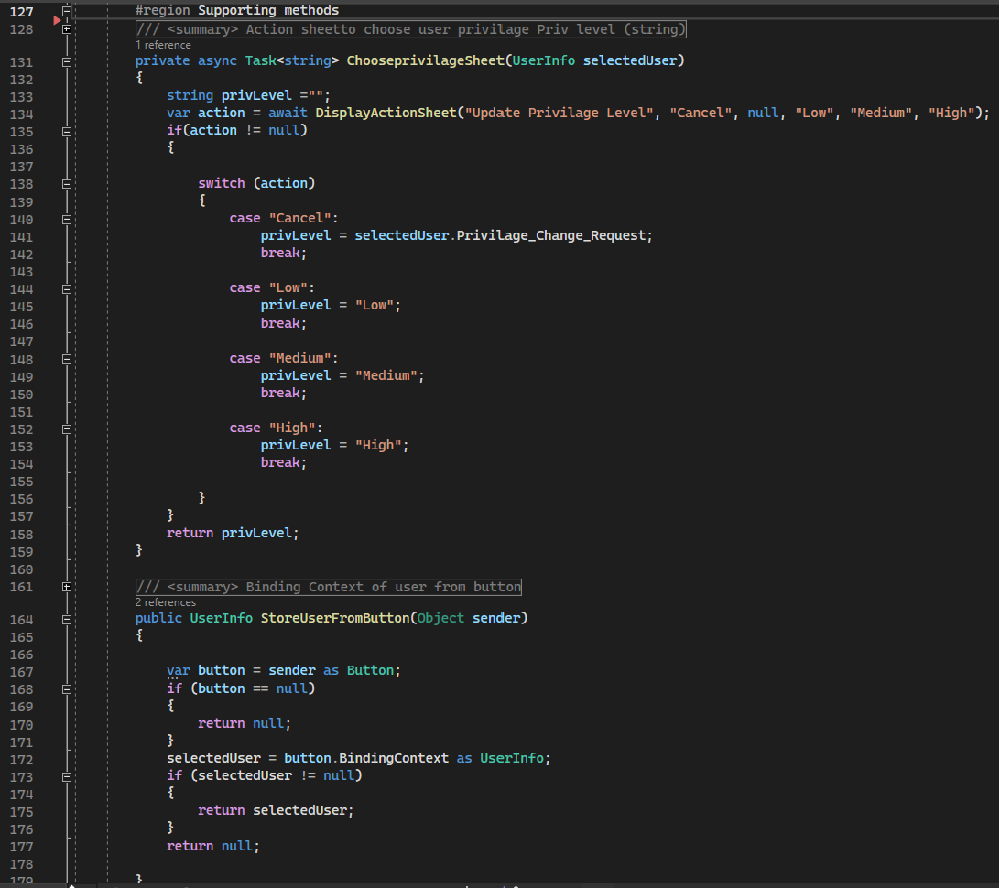
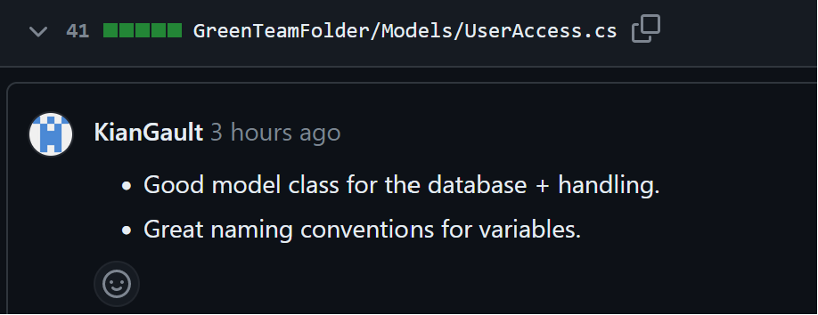
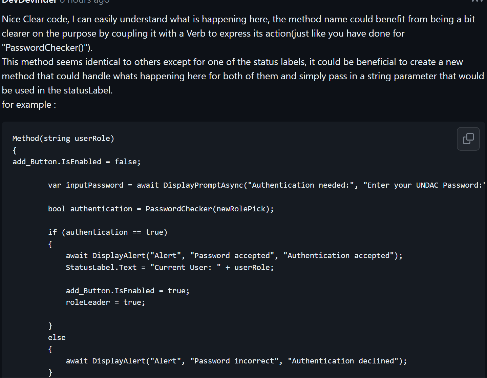

# Project work 4

## Breif
The task worked on this week is :

    "As an UNDAC Team Support and Logistics Manager, I want to request privilege changes for system users so that effective security is maintained

    End user goal: To control access to mission systems

    End business goal: To ensure the data security of the mission

    Acceptance criteria:

    Details of a team member's current system access privileges can be viewed
    Requests for lower privilege levels are automatically approved
    Requests for higher privileges must be approved by the Deputy Team Leader"

To achieve this I utilized I have modified the following classes:

 
#### *UserInfo*
<figure>

<figcaption align = "center"><b>Fig.1 User Info Table </b></figcaption></figure>

  * Database table additions:
    * added field to store privilage level. (Line 19)
    * Added field store Privilage change requests.(Line 20)
#### *UserAccessPage*

<figure>

<figcaption align = "center"><b>Fig.2 UserAccessPage Request privilage changes </b></figcaption></figure>
  <figure>

<figcaption align = "center"><b>Fig.3 UserAccessPage Supporting Methods </b></figcaption></figure>

* Added supporting Methods (fig.3)
  * Lines 131-158: display visual prompt for user to select Privilage level to be requested and return the privilage level. 
  * Lines 164 - 177 : new method that returns the user object being selected from the button being pressed. (This method is shared by multiple method to avoid repeat code)

  * Added Method that is called when button is pressed and utilises both supporting methods of the same class and also calls the *UserAccessDB* class method (this method is shown below in fig.4) passing in the users ID and privilage level chosen.

#### User Access
  <figure>

<figcaption align = "center"><b>Fig.4 UserAccessDB Request privilage changes </b></figcaption></figure>

 * Added Method to handle CRUD operation to the newly added fields:
   * Updates user's privilage level field to "Low" if the request passed in is "Low" and sets privilage request field to "No Request".
   * Only updates the privilage change request field in database to match the request passed in if any other request is given (I.E "Medium" or "High").

#### *UserPage*

<figure>

<figcaption align = "center"><b>Fig.5 UsersPage Approving Changes </b></figcaption></figure>

 * Added Method that:
  * Grabs the current request status of a user.
  * Calls method from *UserDB* class to handle if status is anything other than "No Request" (I.E "High"/"Low") (this method is shown in fig.6) passing in a Users ID and And the current Request status.
  
#### *UserDB*
<figure>

<figcaption align = "center"><b>Fig. 6 UserDB approve/make privilage changes to Database</b></figcaption></figure>
 

 * Method Updates privilage level in database with the Privilage level  request passed in.

### Principles

Much of the principles utilsised here have been covered in prior submissions of the portfolio e.g single responisbility, YAGNI, KISS.

One that has stood out is my improvement of the principle DRY  as I have began examining my code more carefully and been more mindfull in thinking of ways to create new supporting methods to eliminate repeat code as discussed earlier regarding fig.3 as many buttons where using the same code which I had previously overlooked.

### Test Code

<figure>

<figcaption align = "center"><b>Fig. 7 Supporting Test Method</b></figcaption></figure>
<figure>

<figcaption align = "center"><b>Fig. 8 Test Method Using Moq</b></figcaption></figure>

For this weeks testing I have introduced Moq (Mocking Framework) to my testing environment which the team planned to use.

I am still getting used to this framework so I have created a method that populates the database with users by simply using the *AddUser()* method of the mocked *UserDB* class.(Fig. 7) I felt this to be usefull method for tests requiring to pull from the databse and keep them performing a single responisibilty.

Fig.8 shows a test I have done on the *UserPrivilageLevelChange()* method. This Method utilises the set up method shown in Fig.7, grabs the second user from the database list created by the set up method (which will have a privilage level of "Medium" by defualt) and then runs the method being tested to check if when "High" is passed in as a parameter the users Privilage level will be updated accordingly.

The bottom of Fig.7 shows the tets passing

### Code Review
#### Review By Team Member
<figure>

<figcaption align = "center"><b>Fig. 9 Overall Review</b></figcaption></figure>
<figure>

<figcaption align = "center"><b>Fig. 10 UserAccess review</b></figcaption></figure>
<figure>

<figcaption align = "center"><b>Fig. 11 UserAccessPage review</b></figcaption></figure>
<figure>

<figcaption align = "center"><b>Fig. 12 UserDB review</b></figcaption></figure>

Overall The feedback was positive with no changes requested this week as shown in the above Figs.

#### Review On Team Member

<figure>

<figcaption align = "center"><b>Fig. 13 Overall Review</b></figcaption></figure>
<figure>

<figcaption align = "center"><b>Fig. 14 UserAccess review</b></figcaption></figure>
<figure>

<figcaption align = "center"><b>Fig. 15 UserAccessPage review</b></figcaption></figure>
<figure>

<figcaption align = "center"><b>Fig. 16 UserDB review</b></figcaption></figure>

I had found that the code I reviewed was well written and very easy to understand  both what is happening in each method as well as the responisbility of each variable. I had noticed that some instances naming could be improved such as a method name soley being a made up of nouns and a variable that's name did not match its intended use. I recomended introducing a verb to express the purpose of the class and to rename the variable to a more suitable one.

I had discovered some repeat code being used and advised to make a new method to take on the responsibility of the code being repeated which should drastically shorten the code and allow for easier maintenance.

I sense that some code has been copied and pasted from other methods which may be the reason for the variable named not matching its purpose.

I have reviewed this team members code before and notice improvements in naming conventions as a whole.

#### Reflections

This week I introduced myself to mocking with "*Moq*" and found that it can be really usefull for unit testing the CRUD side of the application.

I noticed that although I have gotten my testing environment functional and another team member had managed at one point check it works on one of their machines before mergine the team have decided not to allow the branch to merge incase this causes any set backs. 

This is an issue for me  as due to this I am currently locked out of being able to merge and now my code environment is not matching the rest of the teams. Hopefully this is resolved by next weeks submission.

I have also noticed that the team appears to be smaller and I assume members have joined another team to recieve additional support.
One issue with this is as a team it was unnexpected and confusing as there was no notification of members leaving.
fortunatly one of the benifits of this is there are now more tasks for myself to choose from that are similar to ones I have currently worked on. 
 
This has shown me the importance of writing code following Software engineering principles and doing code reviews as when someone leaves unexpectedly without a trace it is important to be able to read and understand their code that has been left behind.

During his weeks code review I found my code to be a lot more modular, has less code smells such as "Duplicate code" and "Mysterious Name" and will reach a higher Internal quality criteria (also due to having test cases)
My team member is Improving at a fast rate and was relying a bit more on comments to explain the code in previous weeks but has now removed uneccessary comments and instead now uses clear self descriptive code writing.

I will also include an appendix of my code this week at the end of this entry.

* A descriptive summary of the issue that you worked on.
* Snippets from your code with commentary showing how you have used good software design 
  practice.
* A descriptive summary of the test code that you have written.

* A reflective summary of any changes that were requested during the code review along 

  with your fixes.
* A descriptive summary of any issues you found with the code that you were asked to review.
* A general reflective section that identifies, for example,
  * New things you have realised this week
  * Common problems that can arise in a team development situation
  * How your practice compares to other people's
  * etc.

Be sure to include links to the original items in the team's GitHub repository.

In the reflective sections this week, you should highlight ways that you persona practice
has improved as before. It would also be good to reflect on any improvements that have
been made to the agreed team workflow and related procedures. Are things working
better than they were? What further improvements could be made in the future?

## Marking

The marks for this portfolio entry will be split as follows:

* Timeliness: 5 marks (one mark will be deducted for each day or partial day that the submission 
  is late).
* Description: 1 mark is awarded for the descriptive content. You are guaranteed at least one 
  question on this entry in the final interview assessment. Please do not skimp on the 
  descriptive content. 
* Reflection: 4 marks are awarded for the quality of reflection. Again, you should think of this 
  as preparation for the interview assessment.
