# Implementation


# Project work 4

## Breif
This week I worked on improving code and to begin work on the following Task Issue:

    "As a system administrator, I want to maintain reference values for position statuses

End user goal: To be able to list, create, update and delete reference values for position statuses

End business goal: To have appropriate position statuses available to describe a person's position in an organisation (e.g. 'active', 'retired', 'seconded out')

Acceptance criteria:

    A position status item can be created, viewed, updated and deleted (CRUD functionality)

Measurement of success:

    Unit tests pass for all CRUD operations

Notes:

    The database table will be called position_status
    The table will have a single column, name"


<figure>
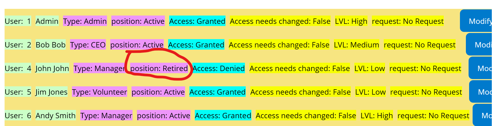
<figcaption align = "center"><b>Fig.1 position Status Displayed </b></figcaption></figure>


I took a decision to simply include a field "Position_Status" to the userInfo table and have the default status set to "Active" when ever a user is added. 
The user page which displays and provides the interface for managing users now displays position status(Shown in Fig.1) and communicates with the userDB class to handle updating this field.

In future updates I will implement a table for Position_Status that focuses only on  this field with an ID column so that other tables can pair this based on ID, that way other classes can freely use the Position_Status table in a more modular fashion.


 ### Changes Made
#### *UserInfo*
<figure>
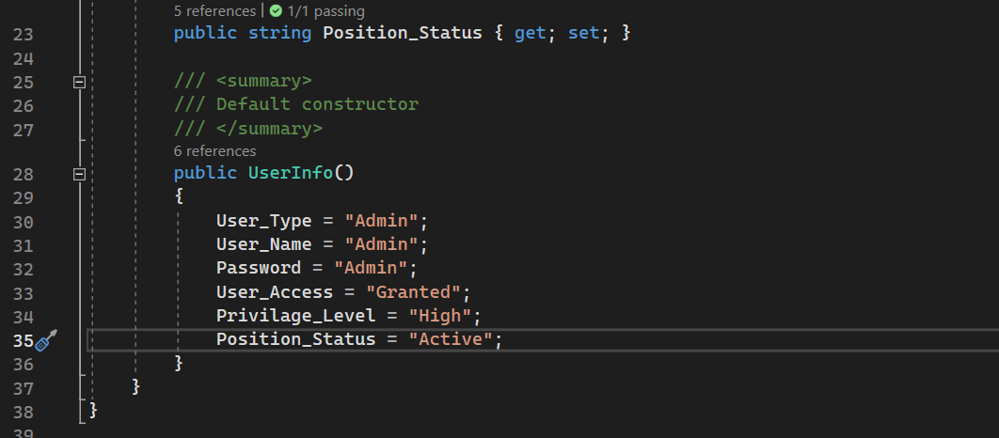
<figcaption align = "center"><b>Fig.2 User Info Table </b></figcaption></figure>

  * Database table additions:
    * added field to store Position Status. (Line 123)
    * Added Default Status "Active" (line 35)


#### *UserPage*

<figure>
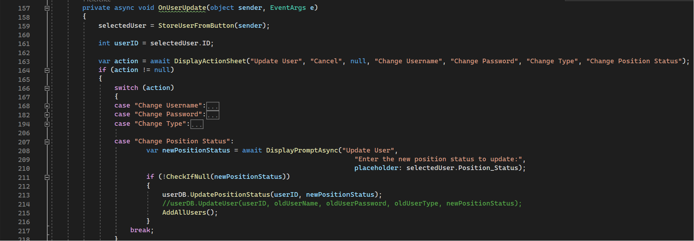
<figcaption align = "center"><b>Fig.3 Update Position status </b></figcaption></figure>

 * Added option to action sheet for position status 
  (end of line 163):
  * Added a case in the switch case for position status which communicates with *UserDB* class to allow system users to update the status() based on string input (lines 207- 217).
 
  
#### *UserDB*
<figure>
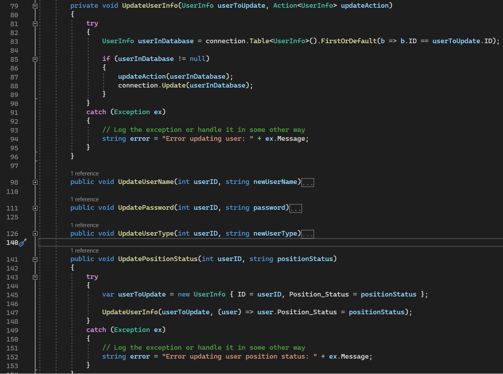
<figcaption align = "center"><b>Fig. 4 changes to user Update methods</b></figcaption></figure>
 
 <figure>
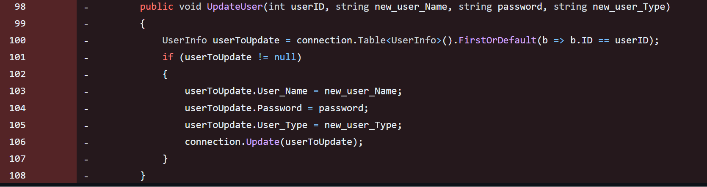
<figcaption align = "center"><b>Fig. 5 Previous Method System</b></figcaption></figure>

 * Made changes to user update methods which handle CRUD operations for the UserInfo table:
    * Added Helper method  to reduce repeate code(Lines 79-96)
    * Created new methods (lines 98 - 141) to focus on each table field being updated (each method is the same with the exceptions for the parameter passed in and table value to be changed)
    * Began wrapping code with Try Catch blocks to log any errors caught when excecuting the code (Lines 143- 153)


### Principles

This week I havent added as much code to the project as previous weeks and instead Focused on making some improvements to the code to try and improve Internal quality such as adding try catch blocks to help with debugging and catching errors and spliting the original method (Fig.5) of the *UserDB* class into a new set of methods, as there was already a large amount of parameters in the original method which was not something that would be viewed as clean code or good practice since this wasnt necessary and easily avoidable.

further refactoring would be benificial as since writing the report I realised that instead of splitting the methods in Fig.4 I could have used another parameter to get the column name to be changed and wrote a method like this:  
```c#
   public void UpdateUserExample(int userID, string propertyName, string newValue)
   {
      
           var userToUpdate = new UserInfo { ID = userID };
           UpdateUserInfo(userToUpdate, (user) => user.GetType().GetProperty(propertyName).SetValue(user, newValue));
   }
     
```
This would reduce repeate code, and have a consice and readible way to update users whilst keeping the parameter count down to a suitable number.

Other changes I would make to my code is shortening method names as "UpdateUserName" for example is quite large and something like "SetUserName" would be a bit more consice.


### Test Code

<figure>
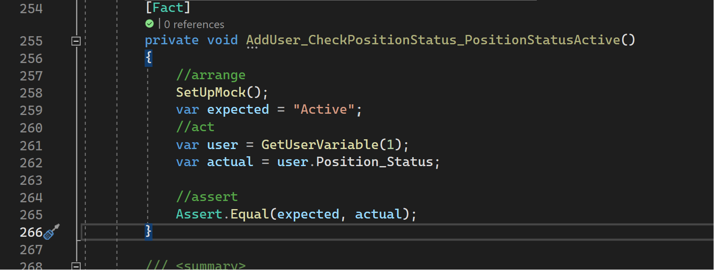
<figcaption align = "center"><b>Fig.6 Testing users are assigned default Status</b></figcaption></figure>


For this weeks testing in regards to the issue I have tested Position status's being asigned the default value when users are added which has passed.

As the CRUD operations are using a private method I still need time to learn using Reflections with moqs but I manually tested the code and the results are the system working as intended.

All other unit tests for my code have passed.

#### Reviews on myself

<figure>
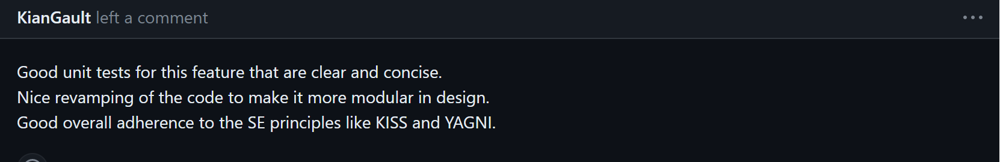
<figcaption align = "center"><b>Fig.7 Review Overall</b></figcaption></figure>
<figure>
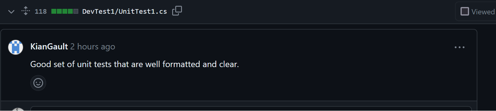
<figcaption align = "center"><b>Fig.8 Review Unit Tests</b></figcaption></figure>

<figure>
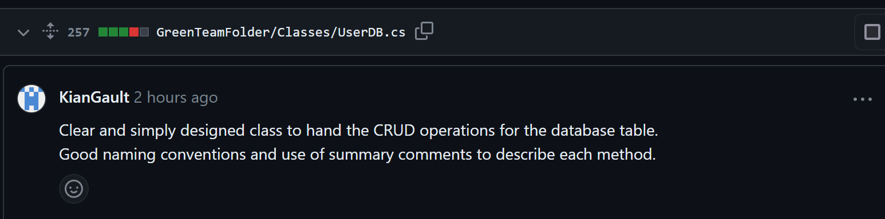
<figcaption align = "center"><b>Fig.8 UserDB</b></figcaption></figure>


Overall The feedback was positive with no changes requested this week as shown in the above Figs.


#### Review On Team Member


<figure>
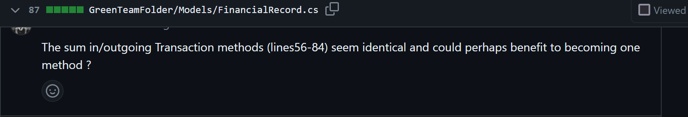
<figcaption align = "center"><b>Fig.9 My Review</b></figcaption></figure>
<figure>
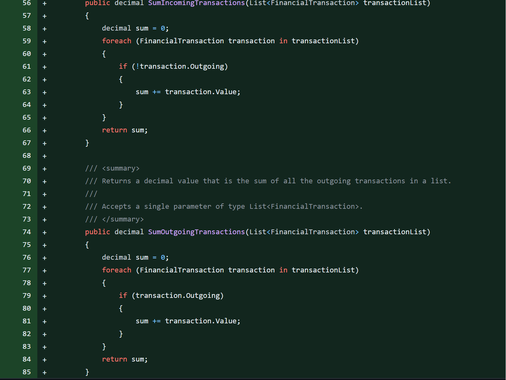
<figcaption align = "center"><b>Fig.10 Code Reviewed</b></figcaption></figure>

The code from this team member was very clear and consistent, the only issue I had found was that two methods are highly similar and could benifit from being merged into one method as it is venturing onto violating DRY.


### Reflections
#### Workflow

Half way into the weak one member of the team merged the project branches into the main which has been a great help as now everyone is working with the same file patterns and environment again. 

Recently everyone has been working on random tasks and it has been difficult to know which tasks are already being worked on as members who have left the team are not removed from the repo and their tasks are still assigned to them in the project board.
without a clear indication who is still in the team and who is not I was advised by existing team members to pick random tasks and to just work on them.

We havent really been doing any planning and instead just goin straight into any task that we wish which is a system were all used to now as we are familiar with our capabilities but more seems like an individualistic survival workflow to just achieve enough content for a portfolio submission.

#### Moving forward

I would like to have achieved more this week in terms of refactoring my entire submissions so far and adding in a few more classes specifically for Position Status's but due to time constraints with work and other coursework and waiting for the merge of branches I have used my time to achieve what I have outlined in the *Brief* section above.

Moving forward I would like to review the class notes on code practices and improve my code accordingly before progressing onto any other task to take advantage of the available matierial.

#### Conclusion

This week I dont feel that I have learned much more in terms of principles from the project work itself, Code reviews on my submissions have been mainly positive during the project weeks so although it is a good sign about how im writing code it does limit my learning potential from others when there isn't much constructive feedback but during each portfolio submission I write I tend to self review my Code further even if unintentionally and I have been noticing ways to improve them for the following week.

