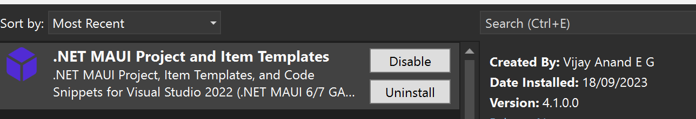
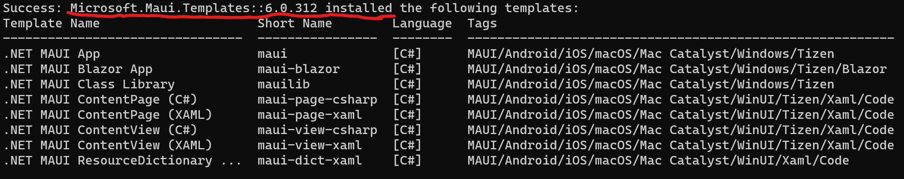
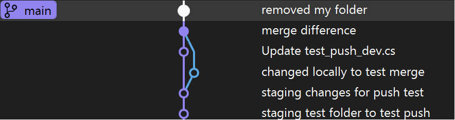
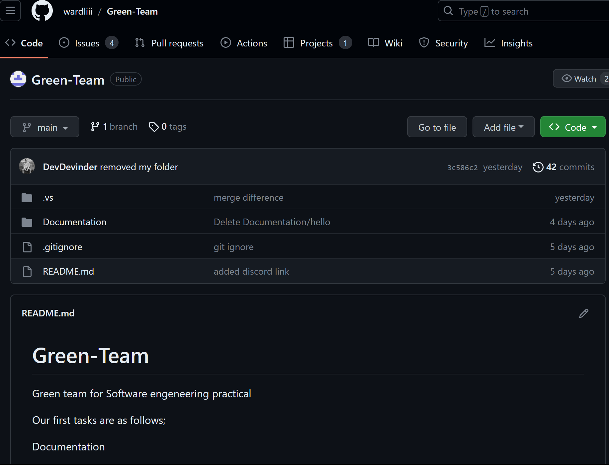
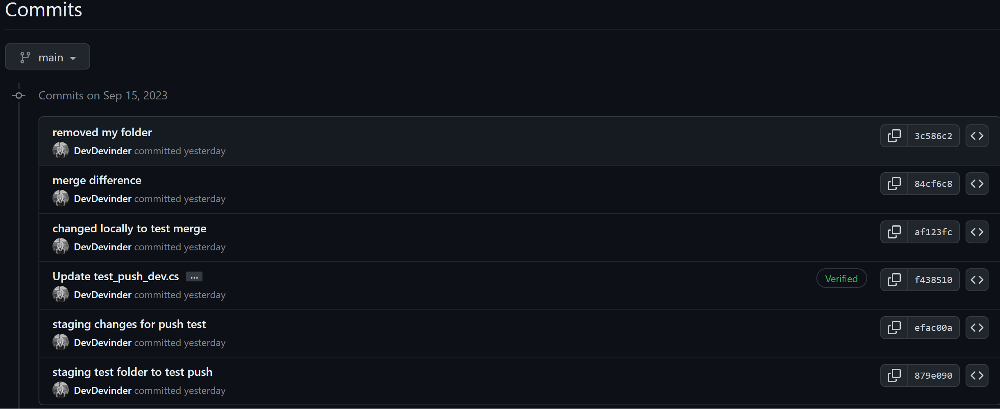

# Setup

For Week 2 team members have been tasked with doing a basic set up which includes installing Visual Studio and ensuring they access to the GitHub Repository. Below is currently my set up in preperation for project development, at the bottom is some of my reflections on setting up for this project at this stage.

### <ins>System Specs</ins>

The computer system that is being used for this project is the *ASUS ROG Flow X13*.

The current specs of which are:

* Processor	AMD Ryzen 9 7940HS
* RAM	16.0 GB
* GeForce RTX 4050 graphics card
* Windows 11 Home
 

### Team Communication
The team are currently using Discord to communicate remotely and face to face at the Napier Merchiston campus.
  

## Environment configuration

### <ins>IDE CONFIGURATIONS</ins>

**IDE used:**
 <figure>

<figcaption ><b>Fig.1 - VS version</b></figcaption></figure>

* *Visual Studio has been installed with the latest version (Version 17.7.3) to allow for development using C#.*

  
**IDE Extensions For The Project:**
 <figure>

<figcaption align = "center"><b>Fig.2 - VS Extension</b></figcaption></figure>

* *Extension installed on Visual Studio to support with utilising MAUI*.

  
**.NET MAUI TEMPLATES:**
 <figure>

<figcaption align = "center"><b>Fig.3 - MAUI Templates</b></figcaption></figure>

* *MAUI templates installed which will help with cross-platform development*.

  
**IDE GITHUB LINK:**

<figure>

<figcaption align = "center"><b>Fig.4 - VS GitHub account Link</b></figcaption></figure>

* *GitHub account that has access to group repository linked to visual Studio for Git version controles.*

  
**Using Git:**

<figure>

<figcaption align = "center"><b>Fig.5 - testing git</b></figcaption></figure>

* *Ensuring Git is functioning through Visual studio Code by testing merges and pushes.*

  
### <ins>GitHub</ins>
**Group Repository:**

<figure>

<figcaption align = "center"><b>Fig.6 - Group Repository</b></figcaption></figure>

* *Repository for the team project which a team member had made for the group is on GitHub where team members have been invited to join and is where the project has been cloned from.*

  
**Viewing Commits on Group Repository:**

<figure>

<figcaption align = "center"><b>Fig.7 - GitHub Commits</b></figcaption></figure>

* *The pushes and merge tests on Visual Studio as seen on fig.5 can also be seen  here on Fig.7 to have successfully been recieved on the Group Repository.*

  
## Reflection

### *Configuring Visual Studio*

#### <ins>Set Up Process</ins>

Installing the IDE and setting up extensions as well as using Git was a familiar process as I have used Visual studio in the past and often use Visual Studio Code paired with GitHub, which is very similar to use.

Although I'm not too familiar with using .NET MAUI, installing the MAUI templates was also straight forward as the assignment notes provided simple recommended instructions for installing and I also went through the official documentation on the installation steps.

#### <ins>Moving Forward</ins>

As the team is in a fresh set-up stage, the configurations at the moment are suitable, but once we have a clearer sense of direction towards the project as a team, it will be best to update our configurations to suit, perhaps by searching for suitable Visual Studio extensions and MAUI Workloads that could help productivity. One extension in mind (that the team could benefit from but doesn't require everyone to have) is GitHub Copilot, which I have found very useful in the past.

#### <ins>potential issues</ins>
As I am not too familiar with using .NET MAUI, more research is planned to not hold back the team with lack of knowledge. This can be resolved by self-learning and buddying with a member who has more familiarity with the framework.

#### <ins>potential issues as a team</ins>

At this stage, I have two areas of concerns regarding potential issues that may occur moving forward:

 
 **1:** 
 
 At the moment, all collaborators (some of whom who are not familiar with version control) are able to push and merge changes into the main branch. During this stage it is not particularly harmful to the project workflow, but as the group is quite a large team, it will be safer to include branch protection rules in the repository settings, especially for the main branch to ensure a safe and efficient workflow, well as minimising setbacks and potential issues that may occur such as overwriting important work.
 

**2:**

As we have only decided on the same IDE, it's also worth ensuring that each team member is using the same versions too, where possible, to minimise risk of errors and compatibility issues, this will also provide the added benefit of more experienced members of the team being better able to guide less experienced members when their working environments are the same or highly similar.

 ## Conclusion

In Conclusion, I feel having MAUI extensions and templates already installed is a good start in terms of preparation as the project will be written in C# and MAUI will make development easier to access different platforms from a single codebase.

Visual Studio is an ideal IDE that has all the features necassery for C# and .NET MAUI and has failry simple version control features that can benifit some of the less experienced members of the team.

Similarly GitHub is a suitable choice for a mix experienced team as it is not only well known and documented but there are many members familiar with GitHub and version control who can assist others up to speed utilising a Buddy system approach.

