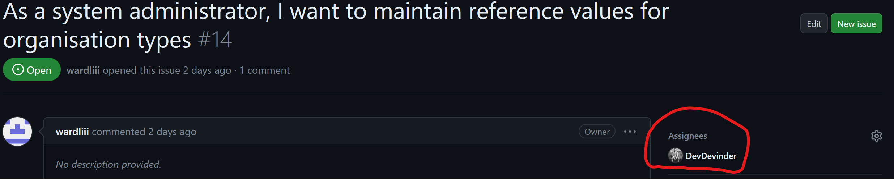
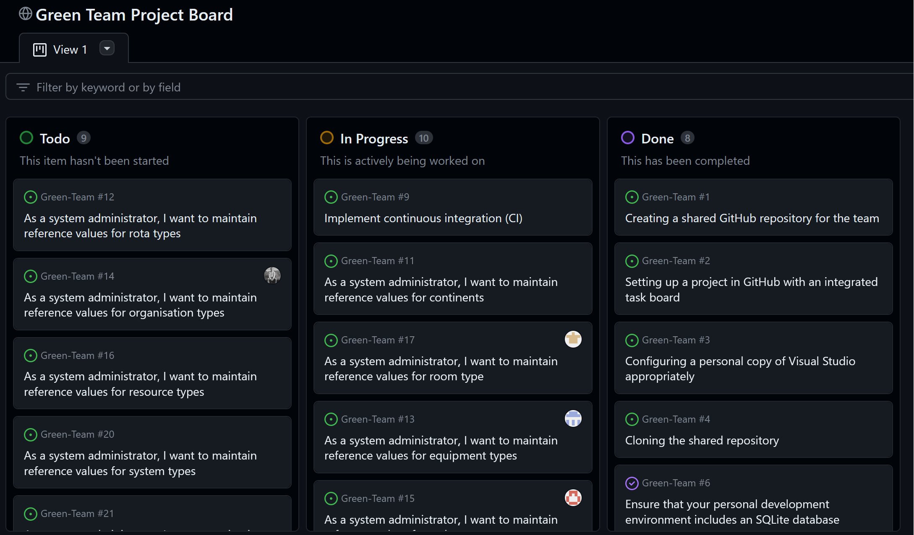
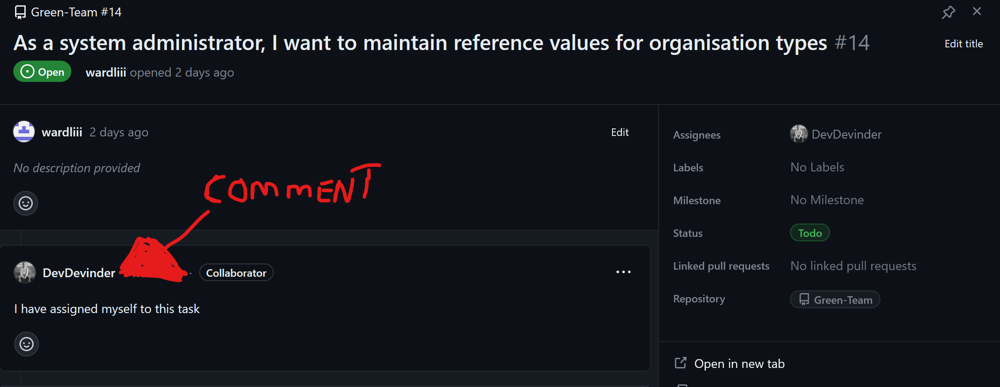

# Workflow

#### <ins>Brief:</ins>
This section highlights during week 3 how the team planned to manage our workflow and track progress, as well as the current stage of development. At the end, there are some reflections on this stage.

## Task workflow

The team are using both the issues and projects tools on Github for tracking and organising tasks and issues. The Issue tab on the groups Github repository is currently used to keep a task list where each member is able to self assign to, which I have done, for example shown here on Fig.1

  
<figure>

<figcaption align = "center"><b>Fig.1 - Self Assigned to issue</b></figcaption></figure>
  
The team are also working from a project board on the group's Github repository to keep track of tasks.

The project board currently organises tasks in three stages, which are named "*Todo*", which represents the backlog, "*In progress*", which represents tasks that a member is currently working on and "*Done*" for tasks that have been completed. Fig.2 below shows the project board with the arrangement of some tasks in their stage of progress.
  
<figure>

<figcaption align = "center"><b>Fig.2 - Project board</b></figcaption></figure>
  
At the moment, members of the team have been asked to leave a comment on a backlog task (task in the "*ToDo*" section) to flag it up for a member who holds the permission to manually move it from "*ToDo*" to "*In Progress*".

Which I have done as shown in Fig.3 by leaving a comment to inform I will take on the task of maintaining reference values of organisation types.The task still remains in the "Todo" Section  of the project board as shown previously in fig.2 as it is yet to be moved by a member with permission to do so.
  
<figure>

<figcaption align = "center"><b>Fig.3 - Project board task comment</b></figcaption></figure>
  

This task has only just been started as a member of the team was creating a starting template for all members to begin to working on their task from within their own branches. as this template has now been created I have successfully made my own branch with the template provided from the main branch as shown in Fig.4

  
<figure>

<figcaption align = "center"><b>Fig.4 - personal branch made from main (template) </b></figcaption></figure>
  

#### <ins>Current Stage</ins>
Currently, members have been asked by the creator of the template to refrain from making any changes to the main branch to prevent any loss or potential issues from the moment until our next meeting unless it has been okayed earlier.

However, moving forward, the team are expected to work from their own branches and make pull requests and, if deemed acceptable, then merge into the main branch. It is also expected that the code will have gone through sufficient unit testing before merging, as well as being clearly documented and that the commit messages should be relevant and clear. 

In the mean time, while the template was being created, I used the time to revise "*Github Flow*" so that I could gain a stronger knowledge of it to not only improve my workflow, but to have a better understanding to be able to aid others who are less familiar with git and Github.

## Reflection

#### <ins>week 2 reflection update</ins>
The recent reflection in week 2 in regards to buddying up and creating branch protection rules was discussed during this week and should be implemented soon which will help with the workflow by giving members more support in their abilities and more confidence when using version controle features.

#### <ins>This weeks reflection</ins>

Unfortunately, the reflection in terms of this week's (week 3) expectations, there were some unfortunate set backs, such as confusions on implementing databases and unexpected issues during the template set up which had caused delays, so not much has been done from my side other than what has been shown in the screen shots above, which was the steps the team at this stage have set out to accomplish although prior to the set backs the team had predicted to be further into development with each member working on their tasks and myself predicting to have achieved completing a task from the backlog.

#### <ins>personal Difficulties</ins>
I noticed that for me personally, outwith university hours, time management may be difficult without  structured organisation, from the team and myself, especially in the early stage of development.

#### <ins>Moving Forward</ins>
Moving forward, I feel the team is in a good position now to begin completing our tasks and most members I am aware of are beginning to get comfortable with the workflow. However, I have realised that there may be a need for more regular organised contact with the team, such as scheduled meetings on the agreed communication channel via "*Discord*", which should benefit everyone by allowing an opportunity to flag up any concerns or issues and to have a more personal update on our progress.

At this stage there hasn't been an official "Definition of Done" agreed with by the team, but clear, well documented Code with some form of development progress from each member is implied to be done ideally by week-4's code review so that we can have a better idea of each others abilities to better estimate how to utilize those abilities.

