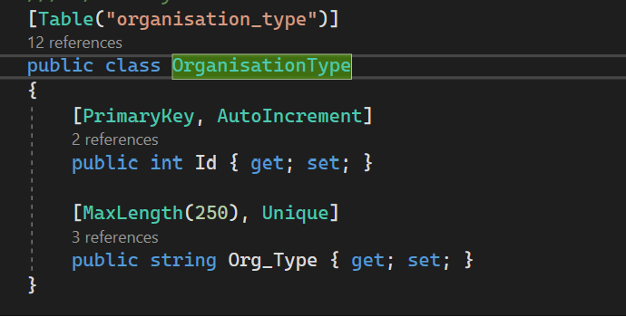
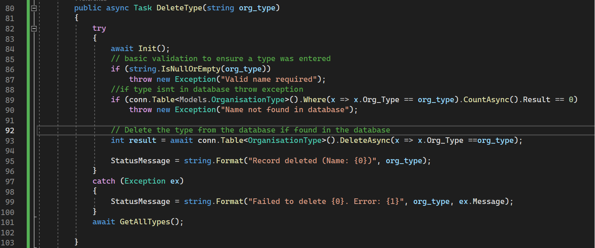
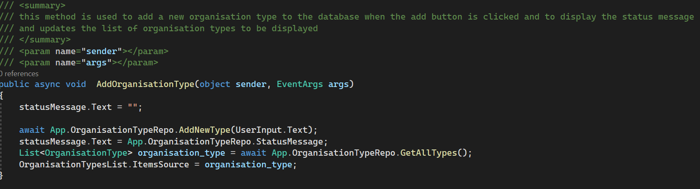
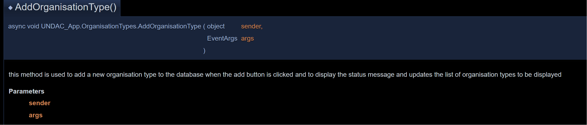
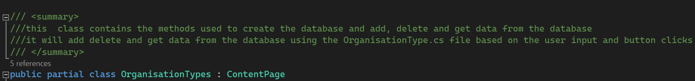
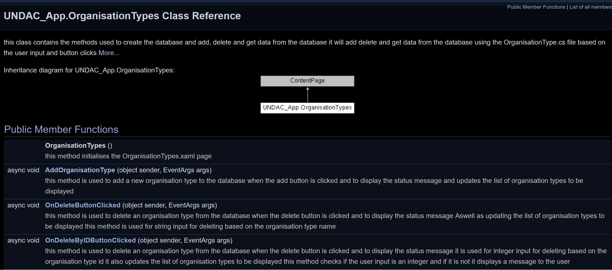

# Documentation
 
In This section of the portfolio I will discuss documentation and Clean Code practices and principles aswell as using the tool doxygen.


## Use meaningful names
When Writing code it is important to use *readable, searchable and meaningful* names for classes, methods and variabls so that they can be easily understood and help to express their purpose.

<br><br>
**.NET MAUI TEMPLATES:**
 <figure>

<figcaption align = "center"><b>Fig.1 - Meaningfull names method</b></figcaption></figure>

```cs
     public async Task<List<OrganisationType>> GetAllTypes()
```

The Above example shows Clearly within the method name that we are using the *OrganisationType* class to get all types("GetAllTypes") of organisations from within the database table. 

<br><br>
**.NET MAUI TEMPLATES:**
 <figure>

<figcaption align = "center"><b>Fig.2 - Meaningfull names variables</b></figcaption></figure>

Next as we can see above the *OrganisationType* class which is used to create the structure of the table easily explains the structure of the *organisation types* table with clear naming for the variables. such as "Id" for the ID number which as can be seen above will be used as the primary keys for the data in the table.

## Functions
Functions should be short with ideally no more than three parameters,  perform only one task with no side effects and be confined to a single abstraction level. the names of the functions should be verbs to help self annotate their purpose.

Fig.1- as shown before Highlights much of this already

```cs
    public async Task<List<OrganisationType>> GetAllTypes()
    {
        try
        {
            await Init();
            return await conn.Table<OrganisationType>().ToListAsync();
        }
        catch (Exception ex)
        {
            StatusMessage = string.Format("Failed to retrieve data. {0}", ex.Message);
        }

        return new List<OrganisationType>();
    }
```
We already discussed the importance of having meaningful function names, but we can see that the contents of the function are also short, self-explanatory, and perform one task. This helps to simplify the code and keep it focused on its single purpose of extracting data to be returned. This also makes it easier to pinpoint any issues that the function could potentially cause that were not caught.

## YAGNI

YAGNI stands for "You Ain't Gonna Need It," which is the concept of not adding unnecessary code that would make things more complicated when you don't need it now.

If we look back at Fig. 2, Meaningful Names Variables, we can see that although we will quite possibly need more variables and structure for the table, it is not worth adding them now in case they complicate things. It is more efficient and readable to add them as we need them to avoid any confusion and clutter.


## DRY
Dry Stands for  "Do Not Repeat Yourself".

It is the principle of avoiding being repeatative with the same code blocks using only minor changes to them for each function and instead create a stand alone function that can be called with parameters to handle those tasks.

<br><br>
**.NET MAUI TEMPLATES:**
 <figure>

<figcaption align = "center"><b>Fig.3 - DRY </b></figcaption></figure>

In Fig. 3 above, we can see that the function DeleteType() performs a single task: deleting an organization type from the database. When this function is called, we also want to refresh the list of organization types on screen for the users. However, rather than repeating the code for the refresh in every function that makes a change, we can simply call the GetAllTypes() function on line 101, which is designed to handle that task. This allows the bulk of the function's code to be focused and relevant to its name and purpose, and it allows us to be more efficient and organized with our code environment.

## Kiss

KISS stands for "Keep It Simple Stupid," a principle that focuses on readability and simplicity by eliminating unnecessary complexity in code.

Much of what has been discussed already is within the aims of this principle.

The key benefit is that code can be easily understood, maintained, and reliable which figs 1,2 and 3 display well. Another factor of kiss that the figs have displayed is that if returning to code after a long break you can understand it perfectly well.


## Comments


Code should ideally be self-explanatory so that when a developer looks at it, they can understand its purpose without further explanation. It is more efficient for a developer and others who may come to work on the same project to write code that is self-documenting rather than focusing on writing comments to explain every step of the code and the variables' purposes.

The main idea behind the principle of clean code in regards to comments is that when tempted to write comments, it is better to think if the code can be written more expressively instead. As shown in Figs. 1 and 2, the code can be understood without the need for comments. However, it can be useful to add some documentation comments to methods and classes so they can be quickly understood without the need to look through the code. This is especially useful for someone who is new to the project and the codebase is quite large.


fig.3 Has some examples of comments that are uneccesarry  such as line 88 :
```cs
              //if type isnt in database throw exception
              if (conn.Table<Models.OrganisationType>().Where(x => x.Org_Type == org_type).CountAsync().Result == 0)
                  throw new Exception("Name not found in database");
```

This comment is only usefull as a tool for training purposes for a specific team member but should be removed as the code is self explanetory already especially with the Exception message.


## Documentation Comments & Using Doxygen

When writing the code I included  documentation comments Above the classes and methods to doccument their purposes.

<br><br>
**.NET MAUI TEMPLATES:**
 <figure>

<figcaption align = "center"><b>Fig.4 - Documentation comments 1</b></figcaption></figure>


We can see here that the documentation comments describe the purpose of the method, although they are over-explained for the team members who may be inexperienced.

The comment also includes the parameters being passed. EventArgs args is a parameter containing the event data, and Object Sender is a reference to the object raising the event here. These are the standard for button click events, so I felt they didn't need further explanation.


<br><br>
**.NET MAUI TEMPLATES:**
 <figure>

<figcaption align = "center"><b>Fig.5 - Documentation comments 1-Doxygen</b></figcaption></figure>

Here we can see doxygen has taken the comments  and produced a html documentation based on the one shown in fig.4.


<br><br>
**.NET MAUI TEMPLATES:**
 <figure>

<figcaption align = "center"><b>Fig.6 - Documentation comments 2-Doxygen</b></figcaption></figure>

Here we can see the documentation comments above for the class which gives a breakdown of the classes purpose.

<br><br>
**.NET MAUI TEMPLATES:**
 <figure>

<figcaption align = "center"><b>Fig.6 - Documentation comments 3-Doxygen</b></figcaption></figure>


In the last screenshot above, we can see that doxygen has produced the documentation based on the comments provided in the summary above the class.

It is also worth noting that doxygen has automatically provided an inheritance diagram for the class, which is a useful feature.

Below the diagram, we can see other methods and their documentation, simplified more neatly.


## Conclusion
Much of the code was heavily commented inline within the functions, as shown in Fig. 3. However, these comments have been removed because they were unnecessary. Much of the comments were simply explaining what each if statement was doing and the variables' intentions. The code was not following clean code practices, due in part to both having a rough draft workflow to begin with to practice the code and to explain the intentions of the code to team members prior to code cleanup. Moving forward, it will be more efficient to stick to clean code practices using documentation comment systems rather than step-by-step inline comments, and to keep the code organized following the six principles discussed.


