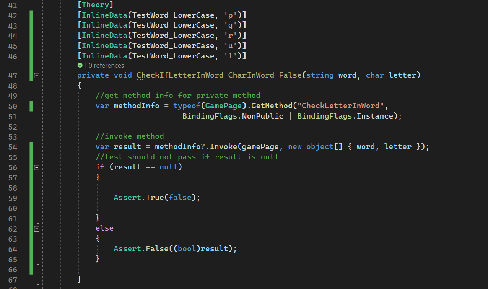

# Testing

# Brief

For this entry, the team worked on another project to create unit tests using the Xunit framework.

The project is a Hangman game that was provided to us by the lecturer.

The core aim of the Hangman game is for users to try to solve the hidden word by inputting letters they believe are in the word.

My task was to choose a method provided and then make it functional and write unit tests on it.

## CheckLettersInWord Method

The chosen method was CheckLettersInWord()
which takes in two parameters.
 
First being a string named word (the word players need to guess) and the second being a char named letter(the players input).
  

The method checks user input  and returns true if the letter is contained within the word and false if not.

## Solution
The solution to achieve this task:
  
  <figure>

<figcaption align = "center"><b>Fig.1 Method to be tested </b></figcaption></figure>

To make the method functional, I first made a conditional to check for nulls, which returns false if so. (However, this should be redundant and checked in the method that is calling this method.)

I then stored both the variable values from the parameters being passed into new variables with lower casings, so that a user does not need to consider case sensitivity.

Finally, I returned the .Contains() method using the lower case variables to determine if the user input is a letter in the word. If it is, the return will be true. If it is not, the return will be false.

## Unit Tests
Here are two of the most important unit tests that have been writen:
  
  <figure>

<figcaption align = "center"><b>Fig.2 Testing if letter is not in word </b></figcaption></figure>
  
  <figure>

<figcaption align = "center"><b>Fig.3 Testing if letter is in word </b></figcaption></figure>

And here is additional info of what is being referenced:

  
  <figure>

<figcaption align = "center"><b>Fig.4 Additional variables</b></figcaption></figure>

For the tests shown in Fig. 2 and Fig. 3, I made preparations by creating a new instance of the GamePage class, as this is the class where I get the method to test, and two test words to avoid using 'magic strings'. These preparations can be seen in Fig. 4.

For both of these tests, I used the Theory attribute to use a data-driven test approach rather than using the Fact attribute. For the tests in Fig. 2, we can see that in the InLineData attributes I am testing against chars that should not be contained within the test words, and if they are not contained, the assertion should be false. The opposite is of course true for Fig. 3, as it is testing for input that **is** contained within the word so the assertations should be true.

These tests are important because the core feature of the game is determining whether users' inputs are correct, and the tests reflect whether the user has chosen the correct letter.

## test results
Tests passed when run in Visual Studio:
 
  <figure>

<figcaption align = "center"><b>Fig.5 tests passed VS</b></figcaption></figure>

 
  <figure>

<figcaption align = "center"><b>Fig.4 Test Passed PowerShell</b></figcaption></figure>

## Limitations

As the method to be tested has a private access modifier, I wrote tests that are slightly more complex than I was expecting too, and I needed to use the System.Reflection namespace to access it.

In the early stages of testing, a few of my tests failed due to case sensitivity. This prompted me to update the code in the CheckLetterInWord method to ensure that the game will ignore case sensitivity, as otherwise it is likely to be a frustrating experience for a player.

another Issue i faced was that when invoking the method like in fig. 2, line 54 I was worried that if for example the MethodInfo or gamePage variable is null then the result variable could be null also which could produce false possitives in tests so I have made changes to these tests to make the test fail if the result is null. as shown in lines 56 - 59 of fig. 2. 

Further improvements will be creating a standalone function to handle repeat code and also finding an efficient way to avoid using "magic strings" completely here, as I am still using them for the chars(letters) in the InLineData attributes.

I also feel that I should have written a separate test for checking case sensitivity so that it would have been more clear what is being tested when running the tests.

