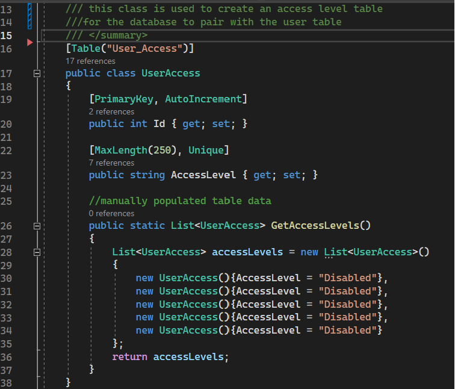
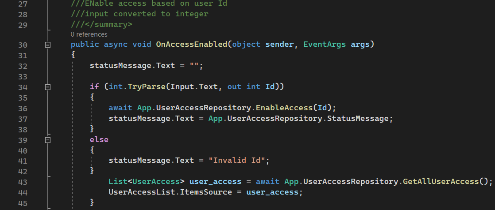
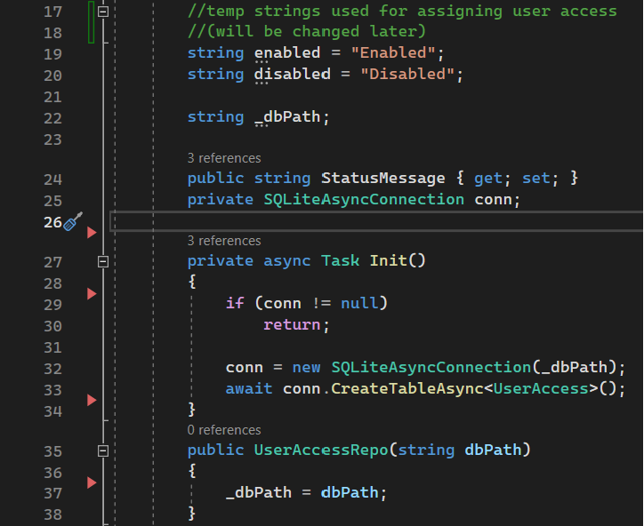
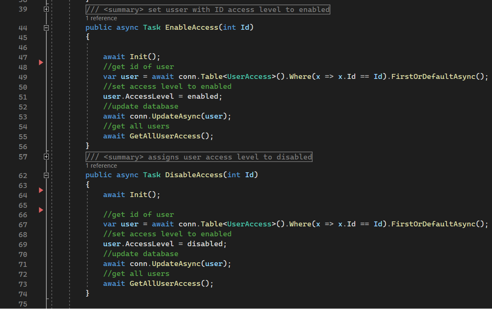
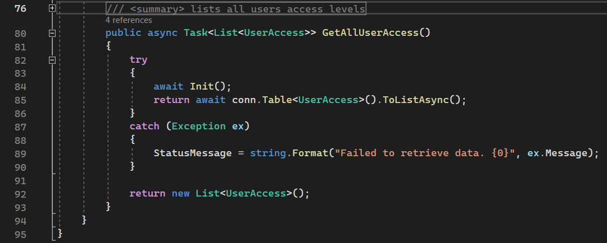
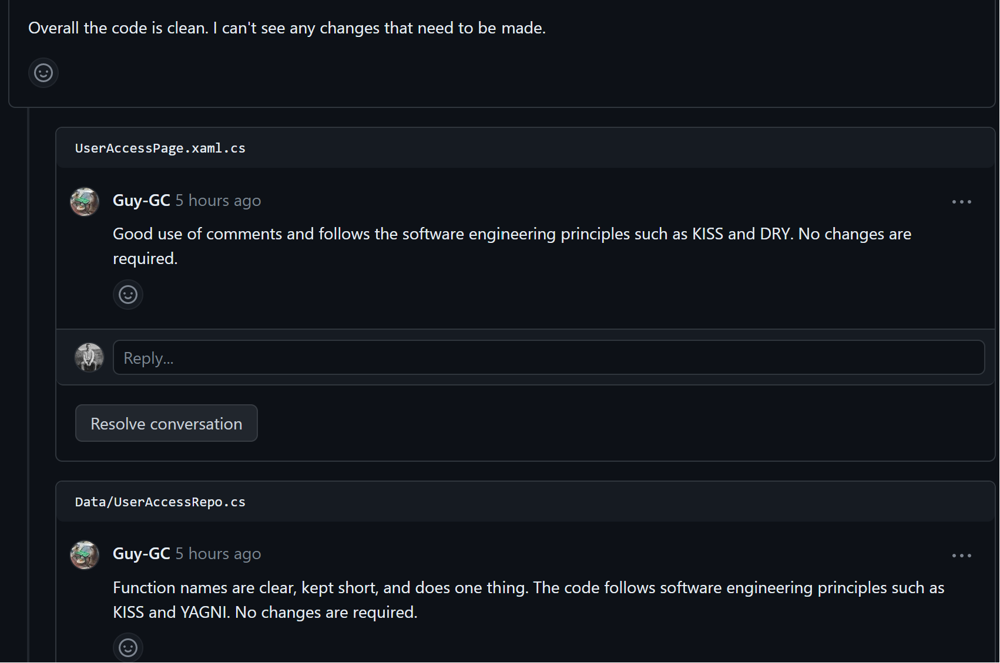
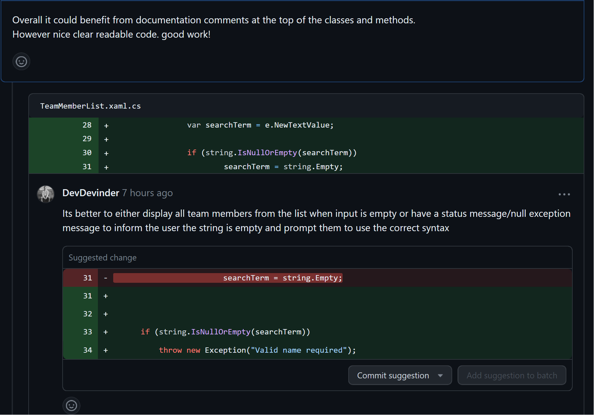

# Project work 1

## Breif 

The task this week is to take on an issue from the project board and use the techniques learned so far such as good programming practices, testing and code reviews.

## Issue Task

The Issue task I have worked on has the folowing description:

  ***As an UNDAC Team Support and Logistics Manager, I want to request the removal of access for uses when they leave so that effective security is maintained***

  ***End user goal: To prevent access to mission system once it is no longer needed***

  ***End business goal: To ensure the data security of the mission***

  ***Acceptance criteria:***

  * ***Requests for removal of access are automatically approved***
    
  * ***Records are not delete when access is removed - they are set to a status of 'disabled'***

To achieve this I worked on creating a table as shown below:

  <figure>

<figcaption align = "center"><b>Fig.1 User Access Table </b></figcaption></figure>

The table is to be paired with a user table in the database so that based on user ID we can assign their access levels to be either disabled or enabled. As there is currently no User table created yet I have populated the table manualy with dummy data to prototype the functionality of this part of the system. 

As the code is self explanetory I have minimised use of comments and reserved them for documentation comments.

I  then created a class that will take user input on the user access page to disable/enable access.

  <figure>

<figcaption align = "center"><b>Fig.2 AccessPage enabling access </b></figcaption></figure>

When a User inputs an ID number they can select the enable access button which will call the method shown in Fig.2 
this method will then convert user input to an integer value or otherwise inform the user that the input field is invalid. If the correct input is entered then the method will call the "EnableAccess()" method from the "UserAccessRepo" class passing in the input value.

Regardless of correct input when this method is called there will be a refreshed list display from the User_Access table which is achieved by calling the "GetAllUserAccess()" method from the "UserAccessRepo" class.

The second function of this class is the disable button which is the exact same code however the only difference being it calls the "DisableAccess()" method instead of "EnableAccess()".

The "UserAccesssRepo" handles the data manipulation of the User_Access table and is used by the inputs from the user on the "UserAccessPage" that was just discussed prior.
<figure>

<figcaption align = "center"><b>Fig.3 User Access Repo Prep </b></figcaption></figure>
Fig.3 shows the basic prep for the class such as two strings for handling setting access levels (lines 19-20)
and the database string(line 22) which is used to store the database path.
Line 24 is used for the display messages to the user and Line 25 is used to get our connection to the database.
the rest of the code in Fig.3 is ensuring there is a database connection and creating one if there isnt already.

<figure>

<figcaption align = "center"><b>Fig.4 User Access Repo Enable/Disable Methods </b></figcaption></figure>

Lines 44-55 of Fig.4 show the Method used to update the table row (based on the user Id)with the new access value.
here in line 51 we simply use the prepared string shown in line 19 of Fig.3 to pass in the new enable value.
Once these changes have been made the "GetAllUserAccess()"method will be called.

The method for dissabling access is identical with the only difference of using the prepared string for disabling access.

The "GetAllUserAccess()" method is used for displaying the table to the users on screen.
<figure>

<figcaption align = "center"><b>Fig.5 User Access Repo Display List </b></figcaption></figure>
This method  returns the data from the table into a list  that is used to populate the collections view of the "UserAccessPage.xml" file so that users of the system can see the changes made aswell as view the list of access levels assigned to each person.

## Testing

The Testing framework I had tried to use was Xunit testing which Is the method team members decided to try using, however team members reported that this was causing issues in the repository and I was also having issues setting it up so the team members who are having issues and myself have decided to postpone testing to the in-person meeting during week 9 and work on setting this up together as a team so we can have a safer more uniform set up as although it is benifitial to do testing earlier than later we felt its not crucial to our workflow for these tasks.

## Code Reviews
### Feedback On My Code
<figure>

<figcaption align = "center"><b>Fig.6 Code Review on my pull request </b></figcaption></figure>

The Code Review I have recieved was possitive and didnt prompt for any fixes or improvements.

## Feedback On My Own Code
As my Code review didnt have any comments regarding improvements I felt neccessary to add a more critical review of my code.

I feel Fig.4 shows extreemly uneccessary comments such as line 54 and in Fig.3 lines 19-20 I could remove the comments entirely and have better names for the temp variables.

I also feel that my code could benifit from more error handling with Try-Catch blocks to improve maintainability and internal quality.

### Feedback I Have Given To Team Member

<figure>

<figcaption align = "center"><b>Fig.7 Code Review Of Team Member</b></figcaption></figure>

<figure>

<figcaption align = "center"><b>Fig.8 Code Review Of Team Member</b></figcaption></figure>

<figure>

<figcaption align = "center"><b>Fig.9 Code Review Of Team Member</b></figcaption></figure>

When Reviewing my team members code I found some code seemed to be uneccessery, that may produce technical debt and is breaching the "KISS" principle such as noted both  Fig.8 and Fig.9. (although I sense it was only breached because team member felt the complexity was neccessary here)

I also found that the internal quality could be improved as shown on Fig.7 in regards to exception handling when dealing with nulls, although Im aware I could have expressed that better and chosen a better suggestion such as using a try catch.
 
overall I can see the code is well written with KISS in mind(dispite my views mentioned above) and has followed the YAGNI principle. It is clear and readible to understand what is happening without comments however the code is lacking in documentation comments which could be helpfull more so as the project grows.

## Reflection

### Code Comparison
When comparing my code to others I noticed that others have more readible and concise code while mine tends to be more aiming for robustness which can add more complexity to simpler tasks. (however this is in general as I feel this weeks task my code is quite basic)

### What I Have Learned
I have learned the importance of code reviews and the benifits of them as I feel more inclined to improve my code practices while writing them when I am aware somone is going to review it. (especially as it may result in having to rewrite it)

Another reason I found them helpful is that it helps to keep you right and you can learn from others opinions and code, regardless whether your reviewing theirs or they are reviewing yours.

I found that when working in a large team on a singular project there needs to be a strong level of communication and regular meetings to ensure that everyone is on the same page and to minimise issues when merging and delays during development. 

Due to this I can see the benifits of having an agreed and upto date workflow, however reaching this point in the submissions have enforeced the realisation that creating a design documentation in the begining would have given the team higher guidance to ballence out where communication is lacking.  

Another problem I faced is that when working in a team it can become problematic when changing the working environment such as adding new dependancies and packages as you need to ensure everyone is working from the same environment set up.

I feel I could have done better to organise communication in the team to ensure everyone has a working set up for testing, (which has been discussed for next weeks meeting) as this was something that could have been resolved within the first couple days and something that needs to be resolved early since ensuring a large team of people are set up correctly takes time.

### Conclusion
In conclusion it's clear Learning a new framework while working on it is often a struggle as it is a big learning curve however it's a difficulty I have found enjoyable and rewarding as upskilling myself to a new framework and comparing code is while becoming a better software engineer is what I am here for.

Moving forward I will need to assign more time into researching the framework so I can improve further on my skillset for this project and assist others who are falling behind and have another attempt at improving communications with team members to work closer together.

