# Project work 2
## Brief

The Task for this weeks entry is to do a continuation of the project from week 8 and to demonstrate how my software engineering practice is improving.

For this portfolio entry I will summarise  my use of good software principles with some screenshots capturing these principles being implemented and focus more on reflection of my progress as a software engineer.

I will also include an appendix of my Code at the end of this entry.


## Issue Task
For this week I have expanded on the previous task issue:

 ***As an UNDAC Team Support and Logistics Manager, I want to request the removal of access for users when they leave so that effective security is maintained***

 Since members of the team have pushed their issues to the main I am now able to see their changes, due to this I performed a complete overhall of my code previously writen during week 8 and updated it to match the theme and structure of other members submissions.

This way the code will be more maintainable following the same patterns as other members and will be more efficient as we are accessing the same Database manager class
which handles the path for the local database(shown bellow in Fig. 1)
<figure>
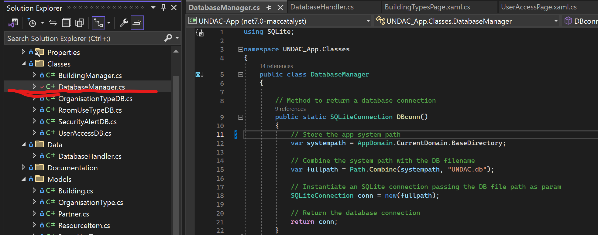
<figcaption align = "center"><b>Fig.1 Database manager class </b></figcaption></figure>

 I have also improved on the task so that the admin can switch user Access to be granted or denied aswell as adding, Modifying and removing users from the database. 

 The reason for including adding and removing users here is due to not currently having a user database system implemented. the code for which can be placed into its own class to handle this but at the moment currently acts as a place holder and preperation for that system implementation.
 This choice was made considering if it breaches YAGNI in mind however I felt this was neccessary and more efficient to do than creating the data manually or additional workload of taking on the task of adding a user database.

 Below (Fig.2) shows the system implementation

 <figure>
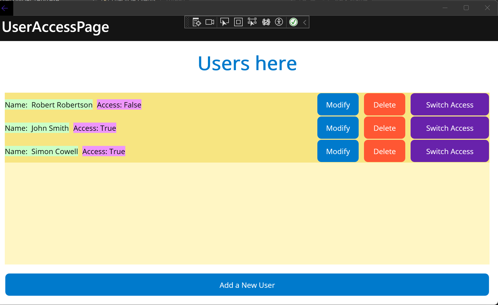
<figcaption align = "center"><b>Fig.2 Example of user access page </b></figcaption></figure>

The page displays the users from the database with their access level(either true or false) and contains 4 buttons which function as follows:

* "Add a New User" prompts for input of user name to add a user to the database(access is automatically set to false).

* "Modify" prompts to enter a new username which updates the existing name.

* "Delete" which removes a user from the database.

* "Switch Access" which switches the access level from true to false and vice versa.


## Software principles used

### UserAccess class
 <figure>
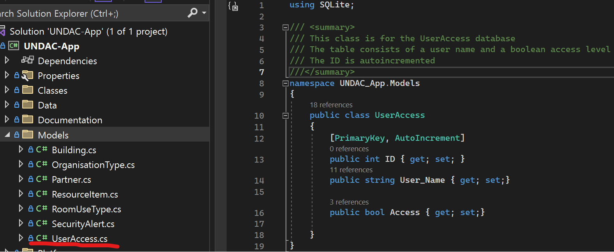
<figcaption align = "center"><b>Fig.3 User Access Class </b></figcaption></figure>

#### Purpose of class:

The UserAccess class is held in the Models folder. 

This class is a model for a database table that stores user names and access levels. The table has three columns:

  * ID: The primary key, which is auto-incremented
  * User_Name: The user's name
  * Access: A boolean value indicating whether the user has access to the system
 
 #### Principles used:

Principles used  in the *UserAccess* class here are:

* **Seperation of concerns**:
Seperated from other classes.

* **Single Repsonsibility**: Has a single responsibility of manage user access information.

* **Encapsulation**: Encapsulates user information only accessed through this class which protects the data from being corrupted.

* **Open/Closed principle**: Is open to extension as new features can be added without the need of changing the existing code.

* **Intention Revealing**: The naming of variables is self descriptive.

* **YAGNI**: I have only included what is neccessary for the purpose of the code.

* **KISS**: The code is simple and straight forward without unnecessary complexity.

These principles have allowed this class to be easily maintainable by myself and by others who havent been informed of it and should remain so even when coming back to it after a long break.
I have avoided descriptive comments which dont appear to be neccessary and focused on only including a class-level comment.


 ### UserAccessDB class

  <figure>
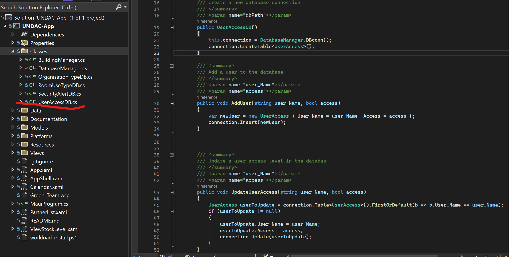
<figcaption align = "center"><b>Fig.4 UserAccessDB</b></figcaption></figure>

#### Purpose of class:

 The UserAccessDB class is contained in the *Classes* folder and is used for handling the CRUD operations for the *UserAccess* table. 

 A short summary of the methods used in this class:

    AddUser() - Adds a new user to the database.
    UpdateUserAccess() - Updates a user's access level in the database.
    UpdateUserName() - Updates a user's name in the database.
    DeleteUser() - Deletes a user from the database.
    GetAllUsers() - Retrieves all users from the database.
    CheckUser() - Checks if a user is in the database.
    CloseConnection() - Closes the database connection.


The Code can be viewed in the Appendix section : *UserAccessDB*

As each method follows the same code principles shown in Fig.4 I will refrain from going through each code block and just use Fig.4 as an example.

#### Principles used:

 * **Separation of concerns:** The UserAccessDB class handles managing userAccess information in the database whilst the UserAccess class is responsible for storing user access information which is a good example of separation of concerns.

* **Single responsibility principle:** The single responsibility of this class is to manage user access information in the database.

* **Don't Repeat Yourself:** The code follows the DRY principle as it's not being repeated in different areas. For example, the code for getting a user from the database is not repeated in the AddUser() or  UpdateUserAccess() methods.

* **YAGNI/KISS:** The code handles only whats needed and does not have any uneccessary methods or variables.

* **Open/closed principle:** As each method is following the above principles the class can have features added without need to modify the existing code.

* **Readability:** The code is readable and easy to understand by use of descriptive variable and method names.

Overall the code is clear and concise and uses clear summary comments which shows how the class and methods are used.


### UserAccessPage class
  <figure>

<figcaption align = "center"><b>Fig.5 UserAccessPage</b></figcaption></figure>

#### Purpose of class:
The *UserAccessPage* class displays the *user access page* of the *UNDAC Application*. It allows users to create, edit, delete, and change the access level of users through button clicks and user input.

A short summary of the methods used in this class:

    OnUserAdd() - Adds a new user to the database(button clicked).
    IsUserInDatabase() - Checks if a user is in the database.
    OnUserTapped() - Updates a user name when the user name is tapped.
    OnUserModify() - Updates a user name when the user is modified.
    OnUserDelete() - Deletes a user from the database(button clicked).
    OnChangeAccess() - Changes the access level of a user(button clicked).
    AddAllUsers() - Adds all users to the list view.


As each method follows the same code principles shown in Fig.5 I will refrain from going through each code block and just use Fig.5 as an example.

However the Code can be viewed in the Appendix section : *UserAccessPage.xaml.cs*
The xaml of this class which hasnt been discuss is included in the Appendix section: UserAccessPage.xaml

#### Principles used:

  * **Separation of concerns:** The class is only responsible for handling the user access page, and it does not contain any code unrelated to handling this page This class uses the other classes to handle the features that the UI provids.
    
  * **Single responsibility principle:** The single responsibility of this class is to display the user access page and allow users to create, edit, delete, and change the access level of users through user input and button clicks.
    
  * **Open/closed principle:** This class allows for new features to be added without affecting the existing code.

  * **YAGNI/KISSS:** The code handles only what's needed and does not have any uneccessary methods or variables. Each method is clear and consise.

  * **Readability:** The code is readable and easy to understand by use of descriptive methods and variable names.
  
  * **Don't Repeat Yourself:** When creating the methods for this class I noticed that each method was utilising the same foreach loop. To avoid violating DRY I created a stand alone method within the class to handle this code instead, thus making the code shorter and more easily maintainable. The method created to achieve this is called AddAllUsers() which adds all users to a list using a foreach loop as shown in lines 177 onwards. 

  The principles here are much the same as the ones listed above for the other classes. However one principle that stood out to me was the benifits of DRY as now should the loop in the AddAllUsers() ever need to be modified developers will only need to make changes to the new method instead of going through each other method calling it. 

### Testing
The team members (myself included) made attempts to implement testing however the xunit framework was posing difficult to set up again. We had hoped to resolve it during the in person meeting but instead decided to focus on our tasks and organising our code together as a priority.
The team have decided to implement testing if possible for week 10 if feasible with time constraints. I have flagged to the team that if we dont manage to resolve it during the meeting in person I will consult assistance from the lecturers or the student helpers.


### Code Review

#### Review of My Code:

  <figure>
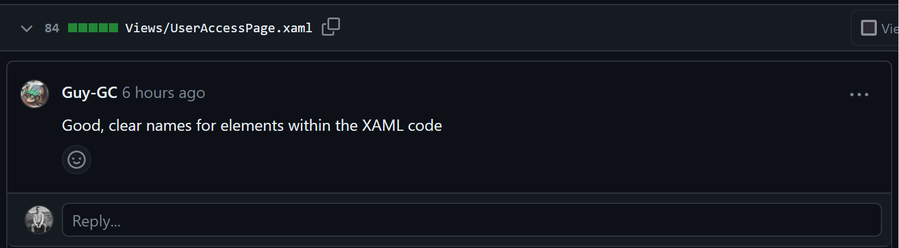
<figcaption align = "center"><b>Fig.6 Review UserAccessPage.xaml</b></figcaption></figure>
  <figure>
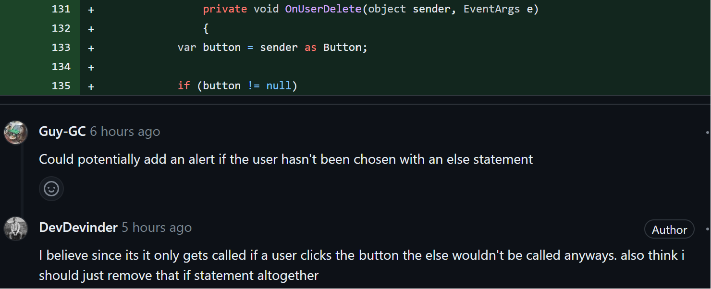
<figcaption align = "center"><b>Fig.7 Review UserAccessPage.xaml.cs</b></figcaption></figure>
  <figure>
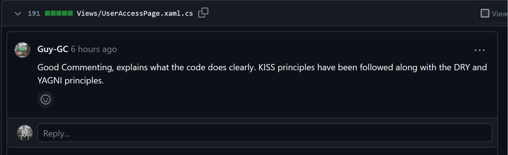
<figcaption align = "center"><b>Fig.8 Review UserAccessPage.xaml.cs</b></figcaption></figure>

  <figure>
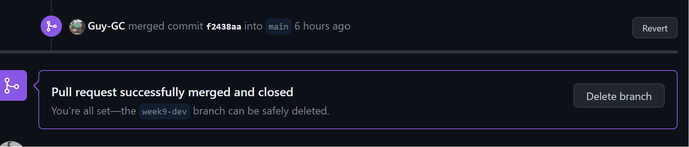
<figcaption align = "center"><b>Fig.9 Approved and merged</b></figcaption></figure>

The code review I recieved was fairly possitive again with some advice to add an alert feature, however I had a discussion with the team member expanding on my comment shown in Fig.7 and we determined that the alert feature isn't necessary, However it was usefull feedback that allowed me to re-look at my code on strategies for improving user experience as aposed to focusing soley on achieving functionality which I will keep in mind moving forward.


#### Review of Team member:
  <figure>
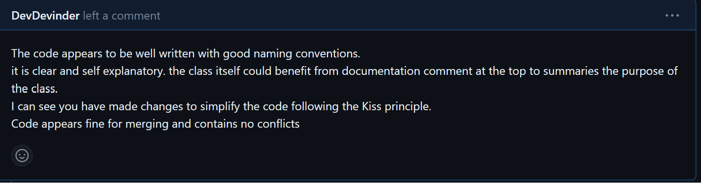
<figcaption align = "center"><b>Fig.10 Overall feedback</b></figcaption></figure>
  <figure>
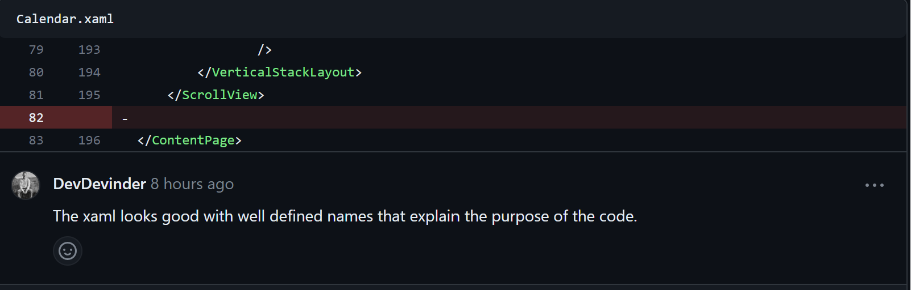
<figcaption align = "center"><b>Fig.11 Calander.xaml feedback</b></figcaption></figure>
  <figure>
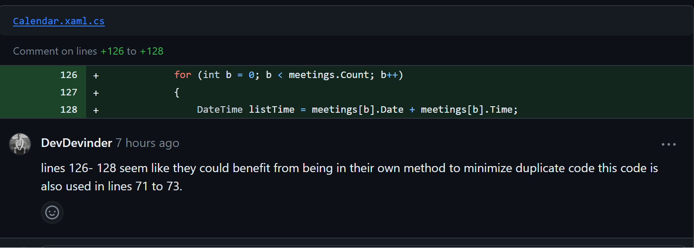
<figcaption align = "center"><b>Fig.12 Calander.xaml.cs feedback DRY violation</b></figcaption></figure>
  <figure>
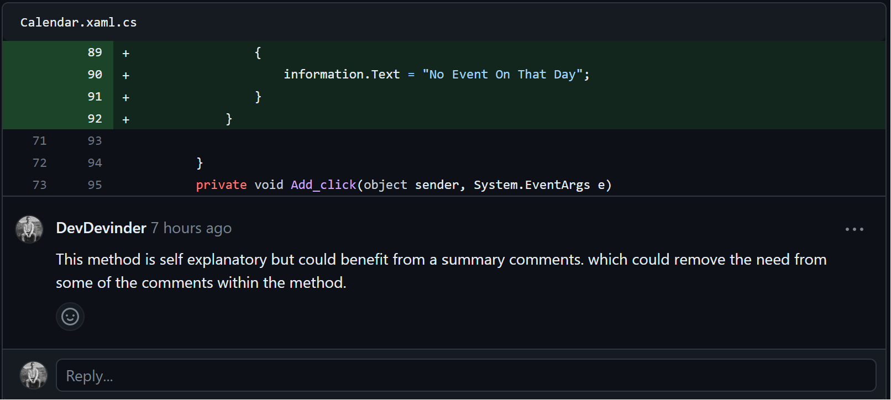
<figcaption align = "center"><b>Fig.13 Calander.xaml.cs feedback advice on comments</b></figcaption></figure>
  <figure>
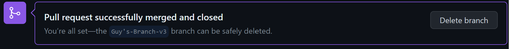
<figcaption align = "center"><b>Fig.14 Merged with no conflicts</b></figcaption></figure>

Overall the code I reviewed looked good, was readible and well written. The only software engineering principle violation I seen was an instance of repeated code which I advised to resolve by creating a new method to handle the for loop as seen is Fig.12.

I had also adviced the team member to include a summary comment of the method which would be helpful to showcase how the method is used dispite the method being written in a way that is self descriptive as shown in Fig.13.


## Reflection

### Code Comparison
Last week I commented that:

    "When comparing my code to others I noticed that others have more readible and concise code while mine tends to be more aiming for robustness which can add more complexity to simpler tasks."

During this week I noticed that my code has improved to follow the YAGNI principle a lot more as my code is more consice and readible however sacrificing some robustness as there is not much exception handling going on this time however I am confident I have the skills to implement this.

When comparing my code with the person's code that I reviewed I felt my code is now more closely aligned and similar to my team member's however I noticed I put a little more Focus into documentation comments and the DRY principle.


### What I Have Learned
After doing an overhall of my code and rebuilding it to fit the theme and structure of my team I found it a lot more easy to minimise code conflicts ofcourse as we now have an organised structure of our folders and files. It was also interesting  and usefull to see how other people have handled their tasks and the different approaches they used to handle similar tasks and functions.

I also noticed that code reviews can be difficult to find issues or improvements with when The code is written with good principles and a similar style to my own however that dificulty prompted me to look more deeply at the code and to think more carefully about it before aproving and merging.


### Final Thoughts on week 9
During code reviews I am unsure if team members are struggling to find issues with my code or if they are being less critical than I am out of kindness, as the reviews I have recieved have been quite possitive without negative feedback. 

This makes it dificult to gauge my level of skill and makes me more reliant on self reflection regarding good principles.

Working in a team has been highly usefull not only for venting about errors but tackling the errors together and offering advice and support for better ways to handle code solution.

I still feel that communication Is lacking, with some members of the team being lot more communicative than others, however this **is** Improving with each week.

The main Issue I discovered working in teams for this project is that stronger memebers of the team tend to be relied on more to solve the issues as aposed to working together to solve them and this may be linked to the communication issues. I have also noticed that some members of the team seem unwilling to recieve assistance when they flagged up that they are struggling.

Since there are now more completed tasks added to the project repository it is easier to maintain and follow the workflow.
prior to this there was only one other team members task that had been merged along side my previous task, this being coupled with the lack of communication made it difficult to ensure I am working according to our workflow in the same manner as others hence the code overhall.


Testing is still an issue I am anxious to resolve but hopefully will be resolved as mentioned in the Testing section of this entry.

Overall to conclude I feel more confident about the workflow and my skillsets at writing clear maintainable code that follows the principles taught during the lessons as this has been the focus of my efforts during week 9. Dispite my thoughts written above I do feel more relieved seing more submissions from the team and it proves that members are infact engaging and getting the hang of this framework.


### APPENDIX

#### UserAccess
```c#
using SQLite;

/// <summary>
/// This class is for the UserAccess database
/// The table consists of a user name and a boolean access level
/// The ID is autoincremented 
///</summary>
namespace UNDAC_App.Models
{
    public class UserAccess
    {
        [PrimaryKey, AutoIncrement]
        public int ID { get; set; }
        public string User_Name { get; set;}
       
        public bool Access { get; set;}

    }
}
```

#### UserAccessDB

```c#
using SQLite;
using UNDAC_App.Models;

/// <summary>
/// This class is used to access the UserAccess database
/// add users, update users, delete users, get all users from the database,
/// check if a user is in the database and to change their access level
/// </summary>
namespace UNDAC_App.Classes
{
    public class UserAccessDB
    {
        private readonly SQLiteConnection connection;

        /// <summary>
        /// Create a new database connection
        /// </summary>
        /// <param name="dbPath"></param>
        public UserAccessDB()
        {
            this.connection = DatabaseManager.DBconn();
            connection.CreateTable<UserAccess>();
        }

        /// <summary>
        /// Add a user to the database
        /// </summary>
        /// <param name="user_Name"></param>
        /// <param name="access"></param>
        public void AddUser(string user_Name, bool access)
        {
            var newUser = new UserAccess { User_Name = user_Name, Access = access };
            connection.Insert(newUser);
        }

      

        /// <summary>
        /// Update a user access level in the databas
        /// </summary>
        /// <param name="user_Name"></param>
        /// <param name="access"></param>
        public void UpdateUserAccess(string user_Name, bool access)
        {
            UserAccess userToUpdate = connection.Table<UserAccess>().FirstOrDefault(b => b.User_Name == user_Name);
            if (userToUpdate != null)
            {
                userToUpdate.User_Name = user_Name;
                userToUpdate.Access = access;
                connection.Update(userToUpdate);
            }
        }

        ///<summary>
        /// Update a user name in the database
        /// </summary>
        public void UpdateUserName(string user_Name, string new_User_Name)
        {
            UserAccess userToUpdate = connection.Table<UserAccess>().FirstOrDefault(b => b.User_Name == user_Name);
            if (userToUpdate != null)
            {
                userToUpdate.User_Name = new_User_Name;
                connection.Update(userToUpdate);
            }
        }


        /// <summary>
        /// Delete a user from the database
        /// </summary>
        /// <param name="user_Name"></param>
        public void DeleteUser(string user_Name)
        {
            UserAccess userToDelete = connection.Table<UserAccess>().FirstOrDefault(b => b.User_Name == user_Name);
            if (userToDelete != null)
            {
                connection.Delete(userToDelete);
            }
        }
        /// <summary>
        /// Get all users from the database
        /// Returns a list of users
        /// </summary>
        /// <returns></returns>
        public List<UserAccess> GetAllUsers()
        {
            return connection.Table<UserAccess>().ToList();
        }

        /// <summary>
        /// Check if a user is in the database
        /// </summary>
        /// <param name="user_Name"></param>
        /// <returns></returns>
        public bool CheckUser(string user_Name)
        {
            //tenary operad to see if the user is in the database
            return connection.Table<UserAccess>().FirstOrDefault(b => b.User_Name == user_Name) != null ? true : false;
         
        }

        // Close database connections
        public void CloseConnection()
        {
            connection.Close();
        }
    }
}
```

#### UserAccessPage.xaml
```c#
<?xml version="1.0" encoding="utf-8" ?>
<ContentPage
    x:Class="UNDAC_App.UserAccessPage"
    xmlns="http://schemas.microsoft.com/dotnet/2021/maui"
    xmlns:x="http://schemas.microsoft.com/winfx/2009/xaml"
    Title="UserAccessPage"
    BackgroundColor="White">

    <StackLayout Padding="16" HorizontalOptions="CenterAndExpand">

        <!--  Title  -->
        <Label
            Margin="0,0,0,32"
            FontAttributes="Bold"
            FontSize="36"
            HorizontalOptions="Center"
            Text="Users here"
            TextColor="#007ACC" />

        <!--  List of building types  -->
        <ListView
            x:Name="UserListView"
            BackgroundColor="#fff6c4"
            ItemTapped="OnUserTapped">
            <ListView.ItemTemplate>
                <DataTemplate>
                    <ViewCell>
                        <StackLayout
                            BackgroundColor="#f7e581"
                            Orientation="Horizontal"
                            Spacing="8">
                            <Label
                                BackgroundColor="#cbffc7"
                                Text="{Binding User_Name, StringFormat='Name:  {0}'}"
                                TextColor="Black"
                                VerticalOptions="CenterAndExpand" />
                            <Label
                                BackgroundColor="#ee96fa"
                                Text="{Binding Access, StringFormat='Access: {0}'}"
                                TextColor="Black"
                                VerticalOptions="CenterAndExpand" />
                            <Button
                                BackgroundColor="#007ACC"
                                Clicked="OnUserModify"
                                CommandParameter="{Binding .}"
                                HeightRequest="40"
                                HorizontalOptions="EndAndExpand"
                                Text="Modify"
                                TextColor="White"
                                WidthRequest="80" />
                            <Button
                                BackgroundColor="#FF5733"
                                Clicked="OnUserDelete"
                                CommandParameter="{Binding .}"
                                HeightRequest="40"
                                HorizontalOptions="End"
                                Text="Delete"
                                TextColor="White"
                                WidthRequest="80" />
                            <Button
                                BackgroundColor="#6822ab"
                                Clicked="OnChangeAccess"
                                CommandParameter="{Binding .}"
                                HeightRequest="40"
                                HorizontalOptions="End"
                                Text="Switch Access"
                                TextColor="White"
                                WidthRequest="150" />
                        </StackLayout>
                    </ViewCell>
                </DataTemplate>
            </ListView.ItemTemplate>
        </ListView>

        <!--  Button to add a new organisation type  -->
        <Button
            Margin="0,16,0,0"
            BackgroundColor="#007ACC"
            Clicked="OnUserAdd"
            HeightRequest="40"
            Text="Add a New User"
            TextColor="White" />
    </StackLayout>
</ContentPage>
```

#### UserAccessPage.xaml.cs
```c#
  using UNDAC_App.Data;
using UNDAC_App.Models;
using UNDAC_App.Classes;
using System.Collections.ObjectModel;
    
namespace UNDAC_App
{
    /// <summary>
    /// this class is used to display the user access page
    /// to create, edit and delete users aswell as to change
    /// user access
    ///</summary>
    public partial class UserAccessPage : ContentPage
    {

        private ObservableCollection<UserAccess> userAccesses;
        private UserAccessDB userAccessDB;
        private UserAccess selectedUser;
        public UserAccessPage()
        {
            InitializeComponent();
            userAccessDB = new UserAccessDB();
            userAccesses = new ObservableCollection<UserAccess>(userAccessDB.GetAllUsers());
            UserListView.ItemsSource = userAccesses;

        }

        /// <summary>
        /// this method is used to add a user to the database
        /// </summary>
        /// <param name="sender"></param>
        /// <param name="e"></param>
        private async void OnUserAdd(object sender, EventArgs e)
        {
            var newUserName = await DisplayPromptAsync("New User",
                "Enter the name of the new User:");

            if (!string.IsNullOrWhiteSpace(newUserName))
            {
                userAccessDB.AddUser(newUserName, false);

                
                AddAllUsers();

            }

            IsUserInDatabase(newUserName);


        }
        /// <summary>
        /// This method is used to check if a user is in the database
        /// </summary>
        /// <param name="user_Name"></param>
        public void IsUserInDatabase(string user_Name)
        {
            //tenary operand to display a message to the user depending on if the user is in the database
            DisplayAlert("User Added", userAccessDB.CheckUser(user_Name) ? "User has been added" : "User has not been added", "OK");
        }

        /// <summary>
        /// This method is used to update a user name when the user is tapped
        /// </summary>
        /// <param name="sender"></param>
        /// <param name="e"></param>
        private async void OnUserTapped(object sender, ItemTappedEventArgs e)
        {
            selectedUser = e.Item as UserAccess;

            if (selectedUser != null)
            {
                string oldUserName = selectedUser.User_Name;
            
                var userNamePrompt = await DisplayPromptAsync("Update User",
                                                           "Enter the name of the new User:");
               
                if (!string.IsNullOrWhiteSpace(userNamePrompt))
                { 
                    userAccessDB.UpdateUserName(oldUserName, userNamePrompt);

                    AddAllUsers();
                }

            }

            await DisplayAlert("User Updated", "User has been updated", "OK");
        }
    

    /// <summary>
    /// This method is used to update a user name when the user is modified
    /// </summary>
    /// <param name="sender"></param>
    /// <param name="e"></param>
    private async void OnUserModify(object sender, EventArgs e)
        {
            var button = sender as Button;

            if (button != null)
            {
                var selectedUser = button.BindingContext as UserAccess;

                if (selectedUser != null)
                {
                    string oldUserName = selectedUser.User_Name;

                    var userNamePrompt = await DisplayPromptAsync("Update User",
                                                               "Enter the name of the new User:");
                    if (!string.IsNullOrWhiteSpace(userNamePrompt))
                    {
                        userAccessDB.UpdateUserName(oldUserName, userNamePrompt);

                        
                        AddAllUsers();
                    }

                }
                await DisplayAlert("User Updated", "User has been updated", "OK");
            }
        }

		/// <summary>
        /// This method is used to delete a user from the database
        /// </summary>
        /// <param name="sender"></param>
        /// <param name="e"></param>
		private void OnUserDelete(object sender, EventArgs e)
		{
            var button = sender as Button;

            if (button != null)
			{
                var selectedUser = button.BindingContext as UserAccess;

                if (selectedUser != null)
				{
                    userAccessDB.DeleteUser(selectedUser.User_Name);

                   
                    AddAllUsers();
                }
            }

            DisplayAlert("User Deleted", "User has been deleted", "OK");
        }

		/// <summary>
        /// This method is used to change the access level of a user
        /// </summary>
        /// <param name="sender"></param>
        /// <param name="e"></param>
		private async void OnChangeAccess(object sender, EventArgs e)
		{
            
            var button = sender as Button;

            if (button != null)
			{
                var selectedUser = button.BindingContext as UserAccess;

                if (selectedUser != null)
				{   
                    userAccessDB.UpdateUserAccess(selectedUser.User_Name, !selectedUser.Access);

                    
                    AddAllUsers();
                }
            }
            
            await DisplayAlert("User Access Updated", "User access has been updated", "OK");
        }

		///<summary>
        ///This method is used to add all users to the list view
        ///</summary>
        private void AddAllUsers()
        {
            userAccesses.Clear();
            foreach (var user in userAccessDB.GetAllUsers())
            {
                userAccesses.Add(user);
            }
          
        }

	}
}```